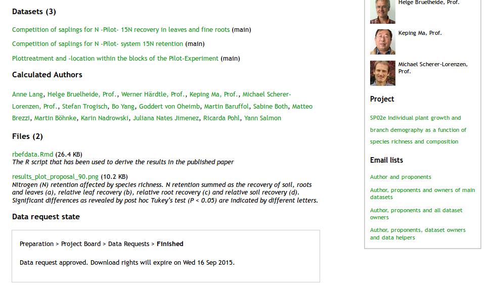

```{r load_requirements, eval = T, include = F}  
# this loads the befdata package
require("rbefdata")  
require("ggplot2")  
options(width = 95)
```

## Title

`rbefdata` - leveraging access to data and semantics

## Abstract

Today ecologists face a deluge of data generated by an interdisciplinary
research community. This This puts much pressure on the development of data
management tools that help researchers to deal with the preservation, the
exploration as well as with the reuse of data. Many concepts and tools have
been developed that provide solutions to different parts of the life cycle of
data. However not all of them are widely spread or accepted throughout ecology.
This situation could be improved by the tight integration of data management
concepts into existing and widely used tools and thus into the daily workflow
of researchers. Paper proposals and data provenance as new ways to promote the
discussion of ideas and collaboration, metadata for data preservation and
information exchange as well as the integration of semantic resources represent
only a few examples of highly valuable concepts with the potential to improve
the scientific progress. 

In this paper we introduce the `rbefdata` R package that provides the R
statistics environment with an access to the open source data management
platform `BEFdata`.  The platform itself has been developed and is used within
the BEF-China experiment. It is specialized in the management of small and
heterogeneous research data that is typical for biodiversity related research.
The R package not only provides access to data and metadata but also offers
upload functionality for datasets and free format attachment files.  To
showcase the functionality of the R package and the interactions with the
`BEFdata` platform we use an R script to go through the steps of an analysis
that has been published already. The analysis is about N retention and the data
has been collected within BEF-China experiment. As the results of the analysis
are published already the data used here is open access and thus the workflow
presented can be simply reproduced. We discuss the introduced R package and the
combination of software in terms of the data life cycle and data management
requirements in ecology. Additionally, we give an outlook on upcoming features
like an improved exploration of data by the integration of semantic
repositories and smart merging functionality that will be implemented in future
versions of `rbefdata` and `BEFdata`.

## Introduction

With a growing awareness on the value of data, many data management platforms
have been developed that preserve all kinds of environmental and historic data.
These provide data preservation plans for small scale projects as well as for
large scale, big data producing, long term or remote sensing collaborations
(e.g.  diversity workbench, GBIF, `BEFdata`, DataONE, LifeWatch). An ongoing
trend is the development of integrative databases or data portals (TRY, GBIF).
They serve as nodes that collect data from smaller databases of a certain
domain and enable researchers to access a wide range of relevant data, all from
one place. These platforms offer a solution to one of the most pressing
problems that we face with our valuable data today, their loss (cite xxx). Even
tough this improves the situation in data preservation, there is still
reluctance to use online data platforms as researchers fear to give away and
loose the control over their data (cite xxx). 

However the demand to reuse available data grows with the amount of data
available. In ecology the reuse of data is of particular interest as the
integration of data offers the potential to answer questions on a much broader
temporal and spatial scale (cite xxx). A problem here is that available data
often is not well described. Metadata gives researchers the opportunity to
understand raw research data even if they are not familiar with it. It is
necessary as plain primary research data can be hard to understand, and even
hard to decipher by the authors themselves after some time has passed. For
example it is hard to remember what methods have been used to collect the data
of a certain column or what the abbreviations and the headers in the dataset
mean. However it is still not used extensively by as it usually means to learn
new tools that help to create the meta data (e.g morpho, dataUP).

Finding relevant data for reuse is a challenging task and it is getting even
more complex with more data available. A common practice in data discovery,
next to full text search in metadata, is the tagging with keywords. However a
keyword search is very coarse and may provide access to a set of data but miss
other essential and relevant data. A keyword search for example on "weight" of
plant organs will miss datasets tagged with "dry weight" or "wet weight" that
might be of interest as well. The integration of semantic repositories that
provide taxonomies or ontologies can potentially improve this situation. They
embed the keywords into a hierarchical structure so the actual search term can
be used to extended the search query with related terms along known relations. 

On reuse data may needs to be cleaned, imputed, reshaped and merged which
usually takes up to 70% of an analysis script (cite Karin and me, and xxx).
These preparatory steps are not only time and labour intensive but potentially
error prone especially if the amount and complexity of data to be included
increases. Workflows are a trending concept as they streamline the processing
of data in terms of access, manipulation and preservation of valuable data
products. Graphical workflow tools like Kepler (cite xxx) or Pegasus (cite xxx)
assist researchers in the access to different data repositories, in reading
metadata and they provide many predefined components that can be used to
manipulate and analyse data. Workflow software that tightly integrates semantic
concepts like ontologies can assist researchers in common preparatory steps of
data analysis like the ones mentioned above (cite michener). 

Metadata as well as paper proposals can reduce the barrier to data sharing for
reuse. While metadata can give an insight into the actual data without the need
to give it away, paper proposal can serve as tool to discuss ideas about
analyses of the data behind the metadata. The integration of semantic
repositories potentially improves not only the discovery but also the
processing of data on reuse. Thus there is a growing demand on tools at the
fingertips of researchers, that easily integrate with their existing tools and
workflows. These need to enable a simple access to data repositories as well as
to assist assist researchers in discovery and the process of understanding
available data.

This paper introduces a new R package called `rbefdata` which is the companion
package of the data management platform `BEFdata`
(https://github.com/befdata/befdata) (cite Karin) and part of the rOpenSci
Initiative. The rOpenSci initiative (http://ropensci.org/) is a community
driven project to provide the R statistic environment (cite R) with a flexible
access to scientific data repositories. The R package enables seamless access
to data and metadata stored on the platform. On top of that it allows for the
integration of semantic repositories as it integrates with the `tematres`
vocabulary server (http://www.vocabularyserver.com/).  We showcase the
functionality of the package available with version `0.3.5`. The workflow
reconstructs a facet of an analysis that has been published by Lang et al. 2013
on nutrient retention along biodiversity gradients. It is a 15N tracer
experiment which aims to disentangle the effect of species mixtures on system N
retention. The workflow depicts how to refine keywords for search in the
thesaurus, ask for data access in the data management platform, download data
into the R environment, inspect metadata, analyse the tracer experiment, and
finally upload data and workflow scripts back to the data management platform.

### BEF-China 

The BEF (Biodiversity Ecosystem Functioning) - China project is a research
collaboration consisting of 10-15 independent research groups, whose
overarching aim is to disentangle the role of tree and shrub diversity for
production, erosion control, element cycling, and species conservation in
Chinese subtropical forest ecosystems'. The BEF-China project
(www.bef-china.de) is funded by the German Science Foundation (DFG, FOR 891)
and uses two main research platforms located in the provinces Jiangxi and
Zhejiang in China (Bruelheide et al., 2012).  

### BEFdata platform

The [BEFdata](http://befdataproduction.biow.uni-leipzig.de/) platform is
specialized in the management of small and heterogeneous data. It adheres to
standards like the Ecological Metadata Language (EML) and facilitates research
cooperation by a paper proposal tool that allows to discuss ideas and to share
data. To create a paper proposal a researcher can select datasets which are to
be included in an analysis. Furthermore basic information like a title, a
rationale, the envisaged journal and a date needs to be provided. Submitting a
proposal, a researcher asks for access to the data and proposes his research
idea to the project board and data owners. The data owners get informed and can
decide if and how they like to participate in the upcoming paper or if they
only like to get acknowledged for providing their data (cite Karin). This
process allows to include or acknowledge all researchers involved in the data
sampling process, it promotes collaborations between research units and helps
to avoid duplication in publication initiatives on the same research ideas
which adds to the transparency of data publication. Finally the datasets
assembled in a paper proposal can be imported in one step to the R environment
by `rbefdata` package. Another strength of the `BEFdata` platform is the
tagging functionality for datasets and data columns which is also used in the
`rbefdata` package to explore datasets.

### Nutrient retention along a biodiversity gradient

In this paper we use an already published analysis on nutrient retention along
a biodiversity gradient as a use case to build a workflow that shows the
functionalities and inter linkages between the BEF-China data platform and the
`rbefdata` package. The analysis is typical for interdisciplinary sciences, as
it combines soil, taxon, and nutrient data where data originating from field
campaigns of different collaborating laboratories has to be merged prior to
analyses. A paper proposal containing 3 datasets was created on the `BEFdata`
portal of the BEF-China project. The rationale given for the paper proposal is:

'Knowledge of biodiversity effects on nutrient cycling patterns in subtropical
forest ecosystems is still very limited, particularly as regards macro
nutrients such as nitrogen and phosphorus. Experimental approaches using tree
saplings may promote an understanding of mechanisms that underlie nutrient
acquisition and cycling in early successional stages of secondary forests and
forest plantations. Insights in the potential of nutrient retention of young
tree plantations are of particular interest in China, where large areas have
been reforested in order to counteract soil erosion and to increase the soils’
water and nutrient retention capacity. In this study we planted saplings of
four abundant early successional (evergreen and deciduous) tree species in
monoculture, two- and four-species combination to test the effect of species
richness on nitrogen acquisition and retention by using a 15N tracer
experiment. A crucial question in BEF research is the appropriate time scale of
experiments which allows species richness effects to emerge. This question
gains importance when long-lived and slowly growing organisms such as trees are
considered. We wanted to analyse whether species richness effects occur during
the establishment phase of early successional tree species typical of
subtropical forests of China.  More precisely we wanted to test the following
hypotheses: (H1) Nitrogen acquisition and retention increases with species
richness due complementary effects in species mixtures. (H2) Species richness
effects strengthen over time.' The respective proposal can be assessed under
(url). For a detailed description of the experimental design we refer to Lang
et al. 2013 

### Tematres server and rtematres

Tematres is a vocabulary management server that enables the management of
formal respresentations of knowledge. These representations can vary in
complexity from simple lists over taxonomies up to ontologies. We use a
tematres server to provide vocabulary in hirarchical order that is relevant for
biodiversity ecosystem functioning research. The `rtematres` R package is
integrated into the `rbefdata` package to exploit the vocabulary server from
within.

### rbefdata

The `rbefdata` R package is the companion package of the open source data
management platform `BEFdata`. The development takes place on GitHub
(https://github.com/befdata/befdata) and the latest stable version can be
installed directly from the CRAN R package repository. The `rbefdata` package
is part of the rOpenSci initiative (http://ropensci.org/) which aims to provide
R packages that enable a seamless integration to scientific data repositories
into the R statistics enviroment. `rbefdata` enables access to data as well to
metadata stored on a `BEFdata` platform. 

The metadata is provided attached to the data frames of raw primary reserch
data pulled from the platform. The package provides convenient methods to pull
single or multiple dataset into the R environment and offers functions that
help to upload final results datasets with the script attached that has been
used to derive the results from the original datasets which provides a valuable
insight into data provenance and also is a stepping stone for reproducible
research. On top of that it also integrates the access to vocabularies stored
on `tematres` servers which can be useful in exploring relevant data for an
analysis.

## Example workflow 

We start setting up the R package, highlight the dataset exploration features
using an example that shows the inclusion the `tematres` vocabulary server
before we finally come to the processing of the data attached to the paper
proposal, the download of data as well as to the upload of final results.

### Setup `rbefdata`

After loading `rbefdata` into the working environment (see box below) the
settings need to be set via the `bef.options()` command. A look into the
options reveals several fields that can be filled in. The most essential
setting for the example workflow we present here is the user credentials. These
are used to authenticate the user against the platform and to ensure the access
to the data has been granted as well as to log the data access. We need to set
it as the data is not yet open access at the time of writing. When it will be
open access in the near future, a key is no longer required to download the
data.

Other options are the URLs to the `BEFdata` server instance and the `tematres`
vocabulary server as well as a field that stores the name of a download folder.
While the URL fields ensure the package communicates with the right servers the
download folder name is used to create a folder in case we download attached
files from a dataset or proposal. In our case there is no need to change the
URL to `BEFdata` server, as it defaults to the BEF-China instance that we use
to retrieve data from. If an own instance of the `BEFdata` platform or has been
set up, this URL needs to be changed so the package communicates with the right
server (see box below).

```{r require_and_setup} 
# load the package
require(rbefdata)   

# list all options 
bef.options() 

# querry a single option
bef.options("url") 
```

```{r require_and_setup_two}
# set credentials example
bef.options("user_credentials" = "aölkjspoiul12")  
```

```{r require_and_setup_three, eval = F, include = T}
# set URL example
bef.options("url" = "http://my.own.befdata.instance.com")
```

```{r load_secret_credentials_and_setup, eval = T, include = F}  
# load your credentials
source("secrets.R") 
```

### Data discovery 

A `tematres` server can hold different representations of formalized knowledge
like a thesaurus or even an ontology of a project. The `rbefdata` package
supports exploiting a `tematres` vocabulary server via the `rtematres` package.
We can find terms and relations as well as we can display their descriptions in
`rbefdata`. This can be used to improve the exploration of datasets. For
example looking for datasets that deal with  "plant organs" we can display the
definition of that term first (box below). Then we ask the `BEFdata` platform
for datasets that are tagged with that term and we get back a few datasets. In
a next step we use the vocabulary on the `tematres` server to narrow down
"plant organs" and we find "leaf",  "root", "twig" as well as plural forms. We
use the narrower keywords to query the `BEFdata` server again for datasets
associated with them and get back all datasets associated with the narrower
terms. This can be used the other way around as well to restrict the datasets
we get back to higher order terms with `bef.tematres.api(task = "fetchUp",
"plant organ")`.
 
```{r improved_data_exploration}   
# define the term plant organ
term_info = bef.tematres.api(task = "fetchNotes", "plant organ")  
term_info

# get datasets tagged with plant organ 
datasets_plant_organ = bef.get.datasets_for_keyword("plant organ")
datasets_plant_organ 

# narrow down plant organ
narrow_tasks_plant_organ = bef.tematres.api(task = "fetchDown", "plant organ")
narrow_tasks_plant_organ  

# enrich the search with narrower keywords
datasets_plant_organ_narrow = bef.get.datasets_for_keyword(c(narrow_tasks_plant_organ$term))
datasets_plant_organ_narrow   
```

### Download data 

The `rbefdata` package leverages data access through paper proposals by a
download function. It loads all associated datasets of a proposal into the R
environment in one single step.  It returns a list object that keeps a data
frame per list element containing a dataset of the proposal each (see box
below). The function requires the ID of the proposal to work, which can be
found in the URL (see box below).


* caption: The paper proposal in its final approved state. The information on that page
           contains a title, a rational an envisaged date and journal. The calculated authors
           and email lists for communication as well as the attached datasets and sub
           projects involved (only partially shown). The proposal is published alredy see 
           (Lang et al. 2013).

```
# the proposal URL shows the id is 90 
http://befdataproduction.biow.uni-leipzig.de/paperproposals/90
```

```{r rbefdata_get_datasets_from_proposal, cache = T}
# proposal id is 
datasets = bef.get.datasets_for_proposal(id = 90)
extract_second_dataset = datasets[[2]] 
head(extract_second_dataset, 5)
```
 
### Inspect data (EML)

Each dataset in the `BEFdata` platform is associated with metadata the authors
of the dataset provide. We also can access the metadata from within `rbefdata`.
It can be accessed either directly via a metadata download command that takes
the ID of a dataset or extracted from a dataset via the R internal
`attributes()` command. The extraction via attributes is possible as each
dataset is attached with its metadata when using one of the download commands
of `rbefdata` (see box below).

```{r rbefdata_metadata} 
# get metadata only, by dataset ID
bef.portal.get.metadata(dataset = 335)$title

# extract title of first dataset in proposal
attributes(datasets[[1]])$title 

# extract all dataset titles in the proposal
titles = sapply(datasets, function(x) attributes(x)$title)
titles 

# other metadata available
names(attributes(datasets[[1]])) 
``` 

The dataset list from the proposal contains three datasets, of which we do only
use the second and third. These two are written into two variables called
`Nretention` and `design` before deciding upon how to merge them. Inspecting
the headers of both dataset reveals each of them contains a column containing a
`plot_id` that seems suitable for merging. But we can also make use of the
metadata for the columns to check if this really is the case (see box below).

```{r anne_script_seprate_datasets} 
# extract into separate datasets
Nretention = datasets[[2]]
design = datasets[[3]]

# overview about the contents of the datasets

# names in dataset Nretention
names(Nretention) 

# description of column plot_id
Nretention_column_plot_id_description = attributes(Nretention)$columns[1,]$description
Nretention_column_plot_id_description 

# names in dataset Nretention
names(design)  

design_column_plot_id_description = attributes(design)$columns[4,]$description
design_column_plot_id_description 
```

### Analyse the data 

After merging the datasets the new synthesis dataset still contains many
columns not required for the analysis that can be dropped. To analyse the
dataset of system N retention we need information about the species diversity
in the plots and about which plot is placed in which block from the design
dataset. 'Species diversity' is used as a factor containing three levels (1,2,4
species mixtures). The response variables have been checked for normality with
`qqplot` and transformed (see box below).

```{r anne_script_two} 
# the synthesis dataset
syndata = merge(Nretention, design)

# overview about the content of the synthesis dataset
names(syndata) 

# remove unwanted variables from synthesis datset
syndata=syndata[-c(9:14,16:41)]
names(syndata)

#> we want to use 'species_diversity' as a factor
syndata$species_diversity=as.factor(syndata$species_diversity)

# square root transforme response variables
syndata$recov_plot_t=syndata$recov_plot^.5 
syndata$perleaf_plot_t=syndata$perleaf_plot^.5 
syndata$perroot_plot_t=syndata$perroot_plot^.5
syndata$persoil_plot_t=syndata$persoil_plot^.5
```

We analysed our data by linear mixed effects models. Since the plots are nested
in blocks, we use block as a random factor. The analysis uses the R packages
`nlme` (Pinheiro et al. 2013) for modeling and `multcomp` (Hothorn et al. 2008)
for post-hoc comparisons. To adjust for an unbalanced experimental design an
ANOVA Type II was carried out to test for main effects using the R package
`car` (Fox and Weisberg 2011). The models have been evaluated visually.

```{r anne_script_load_packages, message = F} 
require(nlme)
require(multcomp)
require(car)
```

```{r anne_script_model_tests}
### Model 1: Overall recovery/N retention  
model1 = lme(recov_plot_t~gbd_T0.mm.+species_diversity,syndata,random=~1|block,na.action=na.omit,method="REML")
anova(model1)
summary(glht(model1,linfct = mcp(species_diversity="Tukey"))) 

# ANOVA type II test for unbalanced design
model1c=Anova(model1,type="II" )
model1c

### model evaluation
#checking plots to assess whether residuals are well behaved 
#plot(model1)
#whether the response variable is a reasonable linear function of the fitted values
#plot(model1,recov_plot_t~fitted(.))
#and whether the errors are reasonably close to normal distribution in all four blocks (Crawley 2009)
#qqnorm(model1,~resid(.)|block)

## Model2 percentage leaf recovery of plot recovery 
model2=lme(perleaf_plot_t~species_diversity,syndata,random=~1|block,method="REML")
anova(model2)
summary(glht(model2,linfct = mcp(species_diversity="Tukey")))
Anova(model2,type="II")

# model evaluation
#plot(model2)
#plot(model2,recov_plot_t~fitted(.))
#qqnorm(model2,~resid(.)|block)

## Model3 percentage root recovery of overall recovery
model3 = lme(perroot_plot_t~species_diversity,syndata,random=~1|block,method="REML")
anova(model3)
summary(glht(model3,linfct = mcp(species_diversity="Tukey")))
Anova(model3,type="II")

# model evaluation
#plot(model3)
#plot(model3,recov_plot_t~fitted(.))
#qqnorm(model3,~resid(.)|block)

## Model 4 percentage soil recovery of overall recovery
model4 = lme(persoil_plot_t~species_diversity,syndata,random=~1|block,method="REML")
anova(model4)
summary(glht(model4,linfct = mcp(species_diversity="Tukey")))
Anova(model4,type="II")

# model evalution
#plot(model4)
#plot(model4,recov_plot_t~fitted(.))
#qqnorm(model4,~resid(.)|block)
```

### Results of the analysis

System 15N retention (overall plot recovery) was positively affected by species
richness at the level of P = 0.0576 (Chisq: 5.7; Fig. Xa). The analysis of the
different system compartments (leaves, fine roots and soil) revealed that fine
root recovery was lower than leaf recovery, and biomass recovery (leaves and
fine roots) was lower than soil recovery.  Whereas the relative leaf and root
recovery were significantly higher in species mixtures compared with
monocultures (Figs. Xb and Xc), the relative soil recovery was significantly
reduced (Fig. Xd). Thus, we could show that the relative N retention of biomass
was significantly increased in mixtures. For an interpretation of these
results we refer to Lang et al. 2013.

```{r anne_final_plot, echo = F}
attach(syndata)
par(mfrow=c(2,2),bty="l")
boxplot(recov_plot~species_diversity,las=1,ylab="N retention (at.%)",col="gray",
        xlab="Species richness")
text(3.4,31,"(A)",font=2)
boxplot(perleaf_plot~species_diversity,las=1,ylab=" Relative leaf recovery (%) ",
        col=c("dark gray","white","light gray"),xlab="Species richness")
text(1,25,"b",font=2);text(2,25,"a",font=2);text(3,25,"ab",font=2);text(3.4,27,"(B)",font=2)
boxplot(perroot_plot~species_diversity,las=1,ylab="Relative root recovery (%)",
        col=c("dark gray","white","white"),xlab="Species richness")
text(1,8.3,"b",font=2);text(2,8.3,"a",font=2);text(3,8.3,"a",font=2);text(3.4,8.3,"(C)",font=2)
boxplot(persoil_plot~species_diversity,las=1,ylab="Relative soil recovery (%)",
        col=c("white","light gray","dark gray"),xlab="Species richness")
text(1,70,"a",font=2);text(2,70,"ab",font=2);text(3,70,"b",font=2);text(3.4,98,"(D)",font=2)
```

* caption:  Nitrogen (N) retention affected by species richness. N retention summed as
            the recovery of soil, roots and leaves (a), relative leaf recovery (b), relative root
            recovery (c) and relative soil recovery (d). Significant differences as revealed by post
            hoc Tukey’s test (P < 0.05) are indicated by different letters.

### Upload data 

Finally we need to decide on either to upload a full dataset which we could do
using the dataset upload function `bef.portal.upload.dataset()` or only to
upload the script and maybe a figure to highlight the road to the results from
the source datasets used. This can be done by attaching to the proposal with
the command `bef.portal.attach.to_proposal()`. For the example shown, it is the
best way to go with an attachment to the proposal as uploading the merged
dataset would only mean duplication of data in the database of the `BEFdata`
portal.

So we upload the script and the four pane figure with its caption to add them
to the proposal. The figure is prepared as Portable Network Graphics (PNG)
using the R internal PNG device. It is written to a temporary folder and then
uploaded. The script in this case is an R markdown file that we attach to the
proposal (see box below).

```{r upload_script, include = T, eval = T, cache = T}
# attach the script using a path  
bef.portal.attach.to_proposal(id = 90, attachment = "./rbefdata.Rmd", description = "The R script that has been used to derive the results in the published paper")
```

```{r prepare_plot_png, echo = F, cache = F}
# prepare the plot figure as png
png(filename = file.path(tempdir(), "results_plot_proposal_90.png"))
  par(mfrow=c(2,2),bty="l")
  boxplot(recov_plot~species_diversity,las=1,ylab="N retention (at.%)",col="gray",
          xlab="Species richness")
  text(3.4,31,"(A)",font=2)
  boxplot(perleaf_plot~species_diversity,las=1,ylab=" Relative leaf recovery (%) ",
          col=c("dark gray","white","light gray"),xlab="Species richness")
  text(1,25,"b",font=2);text(2,25,"a",font=2);text(3,25,"ab",font=2);text(3.4,27,"(B)",font=2)
  boxplot(perroot_plot~species_diversity,las=1,ylab="Relative root recovery (%)",
          col=c("dark gray","white","white"),xlab="Species richness")
  text(1,8.3,"b",font=2);text(2,8.3,"a",font=2);text(3,8.3,"a",font=2);text(3.4,8.3,"(C)",font=2)
  boxplot(persoil_plot~species_diversity,las=1,ylab="Relative soil recovery (%)",
          col=c("white","light gray","dark gray"),xlab="Species richness")
  text(1,70,"a",font=2);text(2,70,"ab",font=2);text(3,70,"b",font=2);text(3.4,98,"(D)",font=2)
dev.off()
```

```{r caption_and_upload_figure, cache = T}
# caption of the figure
caption = "Nitrogen (N) retention affected by species richness. N retention summed as
           the recovery of soil, roots and leaves (a), relative leaf recovery (b), relative root
           recovery (c) and relative soil recovery (d). Significant differences as revealed by post
           hoc Tukey’s test (P < 0.05) are indicated by different letters."  

# upload the figure
bef.portal.attach.to_proposal(id = 90, attachment = file.path(tempdir(), "results_plot_proposal_90.png"), description = caption)  
``` 



* caption: The paper proposal in its final approved state with attachments. The
           attachments are the final results figure and the R script that has been 
           used to derive the results in the published paper.

## Discussion

There is a growing demand to use and reuse available data, which puts much
pressure on the development of software solutions that help researchers not
only to find but also to effectively reuse data (supporting). In ecology
especially the integration of small and heterogeneous data, which represent the
majority of datasets, seems promising as it potentially can be integrated into
a wider context to answer questions on a broader temporal and spatial scale
(cite xxx). However, particularly research areas like ecology which are
characterised by a high degree of interdisciplinary interactions are
challenging in terms of data management.

The software combination of `rbefdata` and `BEFdata` provides solutions to
different aspects of the data life cycle for ecological research groups. While
the `BEFdata` platform covers storage, and data harmonization tools, metadata
support and a social component that fosters sharing data online (cite Karin),
the `rbefdata` package gives easy access to data and metadata on the platform as
well as it provides upload functionality for datasets and attachments like
scripts or figures right from within R. Additionally, the tag based exploration
of datasets helps to find datasets relevant for a certain analysis. The
`tematres` vocabulary server integration further supports this as it allows to
retrieve term definitions as well as semantical relations to broaden or narrow
down search terms. 

`rbefdata` makes scripting a workflow to pull data for analysis and push back
results and scripts simple. The upload mechanism can help to keep the data
management platform up to date on the fly and gives other researchers the
possibility to reproduce results by downloading scripts attached. An uploaded
script is not only a stepping stone to reproducible research but also helps to
track down data provenance which can be interesting in acknowledging data
providers even for only one data column that has been used in an analysis. 

While it seems a waste of time and bandwidth on one hand to always transfer the
data to a local script for processing, this approach also has its upsides.
Having the data locally offers full flexibility in choice of tools and also
enables the researcher to freely mix in other local data sources. While this
approach works well for small data it does not for big data since the transfer
of data is not possible for large sized data. The recent trend here is
on-server/in-database statistics, a scenario where scripts are to be sent to
the server before it returns the answer after processing (xxx). To keep the
`BEFdata` platform as flexible as possible and to give the researchers the
freedom of choice this could be one of the future features to be integrated. 

### rbefdata makes metadata available within the R environment

.  `rbefdata` is innovative in that it
provides data together with metadata in the R environment.


### keeping workflow scripts close to the data: Provenance

While well described data helps a lot in understanding datasets and on
deciding upon the relevance and applicability of data for a certain analysis
there is still lots of manual intervention necessary to prepare the data for
analysis (cite Karin and me? or xxx). It may needs to be cleaned, imputed,
reshaped and merged which usually takes up to 70% of an analysis workflow,
before smart models can be applied to the data to find interesting patters
(cite the workflow paper of Karin and me). This preparatory steps not only are
time and labour intensive but also potentially error prone, especially as the
complexity of the analyses increases. Provenance and the advantage of keeping
scripts (workflows) close to the data.

Clarify: controlled vocabulary - thesaurus - ontology. Controlled vocabulary
for finding and sorting, ontology for automatic reasoning.

*** Semantics for searching and sorting

We decided not to develop functionality to develop nested controlled
vocabularies within BEFdata. This decision was based on the fact that there
are already sophisticated frameworks and software to develop and maintain
vocabularies. Linking to external vocabularies has the additional advantage
that several data repositories can simultaneously use the same thesaurus for
tagging their data. This keeps single repositories small and coherent without
loosing the potential to link them to other repositories (linked data,
citations for linked data).

*** Semantics for automated reasoning


This is a separate argument, and we do not touch it in the results: automatic
merging should be only in the discussion:

but also could be used in the process of integrating the data
for analysis. 

Additionally it can be error prone especially if analyses get more complex and
require the expertise of more than one research domain.  


Ontologies, as formal representations of knowledge, potentially offer a
sophisticated tool to deal with that step of data preparation (e.g michener et al 2012). 
While they are already used in some research domains like genetics (cite xxx, eg. http://www.geneontology.org/),
other domains face more problems using it (cite xxx, morpho team announced
semantic tagging but the plug-in did not appear anywhere). The application of
ontologies in ecology is discussed controversially (cite xxx) and it is argued
that they can be a huge benefit, but it is hard to set up a sophisticated
ontology covering all necessary terms and relation of a highly complex research
domain (cite xxx).


We recently started to develop an ontology using a `tematres` .The
formalization we develop will be based on the knowledge used in biodiversity
ecosystem functioning research. 

The `BEFdata` platform will get a semantical tagging feature that will allow data
owners to tag data fine granular ?? on data column level. Using the same
formalized knowledge from the ontology we will be able to provide smart merging
and transformation features within the `rbefdata` package that help researchers
to merge datasets semi automatic.

While data storage and description is almost the same for all kind of data the
effective interlinking of data via an ontology requires the development of a
common terminology. The terminology should not only be accepted but used, developped and discussed
by all contributing scientist of the project. The future goal on ontologies is of
course the development of domain ontologies that can be interlinked to an
overarching ontology. Thus, collaborative ontology
engineering approaches like `ontoverse` (Zoulfa El Jerroudi et al. 2008) or
`tematres` are highly valuable as they not only help to set up ontologies but
also to develop and maintain them over time even if the researchers change that
contribute to it.


## Acknowledgements

Thanks to all the data owners of the proposal for providing access to the
datasets. ...

## Literature

This will be done externally as markdown has no good way to deal with
references and stuff. We can collect here a list of links to references. I will
then collect them with e.g zotero to export a format we can hand them in for
publication.

## Appendix

### Figures

### saveaway 

We discuss `rbefdata` and `BEFdata` in in the light of current and future
challenges for data management give an outlook onto upcoming features that
could help to solve them. 

The data here is mainly provided by small scale studies spread all over the
world (e.g heidorn2009 shedding light on the dark) but also through bigger long
term projects like LTER (cite xxx), BEF-China (cite xxx), governmental projects
and local initiatives (cite xxx) and private persons. This in fact results in a
wild growing, complex and heterogeneous data landscape that an ontology would
need to capture to be usable.


### intro karin

Karin:

thesauri, ontologies, etc. ... 

Something on data discovery and paper
proposals: Interdisciplinary analyses depend on data coming from different
research fields. Not one single research project or laboratory measures all
data, but they come from different researchers.  Data discovery - finding data
that is suitable to answer a pressing question - has become an integral part of
science. Data discovery between scientific disciplines is hampered by different
vocabularies and missing agreement on common semantics. Tools addressing this
problem are


Introducing workflows, their merits, and ROpenSci. But also Kepler, Pegasus,
etc. Cite our paper on workflows.

 (http://ropensci.org/),
which is a community driven approach to wrap all science APIs and to create
solutions for R users to seamlessly pull data from different repositories
spread over the internet into R for analysis.  


### material and methods 

Karin: 
- I would suggest to reduce the details of the following dramatically:

The Main experiment was established in 2009 and 2010 as the first large scale
forest biodiversity–ecosystem functioning experiment in the highly species-rich
subtropics.  In total, the area covers 50 ha and there are 566 plots of 400
trees each, ranging in diversity from monoculture to 24-species mixtures. The
experiment used 42 native tree species and 10 shrub species, combined into
different species pools. More than 400 000 tree and shrub saplings were
planted.  In a parallel observational approach, a total of 27 Comparative Study
Plots (CSPs) of 30x30 m each were set up in existing forests in the adjacent
Gutianshan National Nature Reserve (Zhejiang Province) in 2008.  The
observational plots were selected according to a crossed sampling design along
tree species richness and stand age. The CSPs address the impact of
successional age on ecosystem functioning, providing a basis for assessing the
successional processes at work across tree species diversity in the Main
Experiment . 


### Data processing and integration

* sharing ideas for analysis: paper proposals 
      Paper proposals are an emerging concept solving transparant data exchange and
      reuse across disciplines and laboratories [citations!]


* Introducing workflows (merits, ROpenSci, Kepler, Pegasus, etc.) Cite our paper on workflows.
* Workflow repositories and software 
* R needs to be learned as well that is no argument to less acceptance of other tools like Kepler, is there?!
* Provenance and the advantage of keeping scripts (workflows) close to the data.


### Wrap up (introduce solutions)

Especially for highly interdisciplinary research domains this requires the
input of many scientists and discussions about definitions and relations of
terms in the representation.  This might be one of the reasons why there is a
lack of sophisticated ontologies especially for highly interdisciplinary
research domains like ecology. 


Karin: there are some papers talking about what users want from data
repositories. These could be cited (e.g. Kerstin Bach). Motivate that
researchers prefer to perform the analyses at their own laptops.


While data preservation and the access to data for a wider audience are covered
very well, the use of metadata and semantic concepts, which both are related to
the efficient reuse of data lacks behind.  On one hand this is related to the
reluctance of users to use new tools or the fear to loose control over valuable
data. But on the other hand this is also related to the fact that the valuable
concepts are not yet tightly integrated enough into the researchers daily
workflow.


* intro summary frame

A multitude of data management and knowledge platforms are emerging which
contribute to a growing global data pool. The need to effectively reuse the
available data, grows with the data pool. This puts much pressure on the
development of tools that tightly integrate valuable concepts into existing and
widely accepted tools and into the workflows of researchers to help them
dealing with the upcoming challenges in data management and analysis.

* data preservation -> many data available


