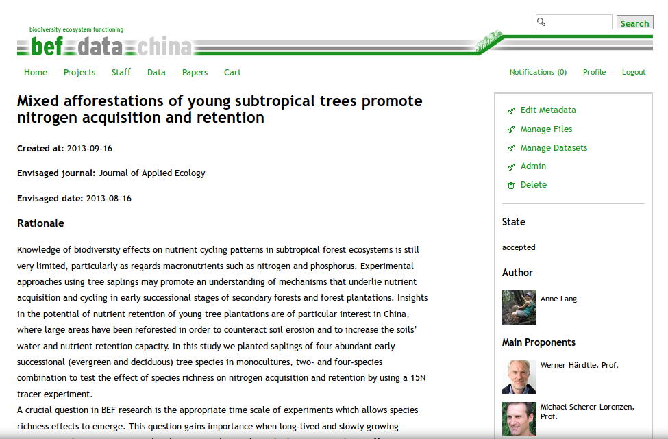

```{r load_requirements, eval = T, include = F}  
# this loads the befdata package
require("rbefdata")  
require("ggplot2") 
```

## Abstract 

The story board:

* Huge amount of data available (deluge of data)
* More and more gets accessible (with some hindrances) 
    - metadata missing (renders data useless) 
    - lack of reward for data providers (people keep their data secret)
    - so lots of data gets still lost (needs help e.g rebind)
* Data often hard to find/reuse 
    - if not well described 
* But there is a growing need to reuse data 
    - so we need tools supporting researchers in doing so (reuse available)
* The BEFdata portal provides a good base for heterogeneous data in ecology  
    - we dock onto that with rbefdata to pull data into data statistics  
    - Data life cycle (we cover it partially focused and doing this well) 
        + BEFdata (Store data, Describe it with metadat, Collaborate and Share it)
        + rbefdata (Find and understand and analyse data as well as reuse of data). 
* Maybe also shorlty introduce the data lifecycle and use it to show to which 
  parts of that cycle we offer soutions.

## Introduction 

With a growing awareness on the long term value of data, much effort has been
put into building data management platforms, to preserve all kind of
environmental and historic data, over the last years (e.g. diversity workbench,
BEFdata). Many specialized solutions for different scientific disciplines
appeared that provide data management plans for small scale projects or
collaborations as well as for large data producing long term or remote sensing
projects. An ongoing trend in that context is the development of integrative
databases or data portals. They serve as nodes that collect data from smaller
databases of a certain domain and they give researchers of that domain the
opportunity to access a wide range of relevant data from one place.  This
portals in fact offer a solution to to one of the most pressing problems that
we face with our valuable data today, their lost. 

Another big problem with data, especially in terms of reuse of available data,
is the general understanding of datasets. Usually plain datasets say nothing,
to one who is not familiar with it and they are even hard to decipher by the
author itself after some time has passed. It is usually hard to remember
exactly what methods have been used to collect a certain columns data or what
the abbreviations or headers in the dataset mean. To solve this this problem
metadata frameworks have been developed and published as standards so nobody
really needs to think about an own set of requirements to describe its data.
The Ecological Metadata Language is only one example for that. While this
theoretically solves the problem with not well described datasets it is still
hard to make people use it extensively as this usually always means to learn
new tools that help with the description process.

While well described data helps a lot in understanding datasets and on deciding
upon the relevance and applicability in a certain analysis there is still lots
of manual intervention necessary after that to prepare the data for analysis
(cite yourself? or xxx).  It may needs to be cleaned, imputed, reshaped and
merged which usually takes up to 70% of the analysis workflow, before the smart
models can be applied to the data to find interesting patters (cite the
workflow paper of Karin and me). This preparation steps not only are time and
labour intensive but also potentially error prone, especially as the complexity
of analyses grows. 

Ontologies, formal representations of knowledge potentially offer a
sophisticated tool to deal with that step of data preparation (cite supporting
ecology as data intensive science). While they are already used in some
research domains like genetics (cite xxx), other domains face more problems
using it. For example in ecology, that has grown into a very collaborative,
interdisciplinary and data intensive science over the last decade, to address
questions on a greater temporal and spatial scale (e.g michener et al 2012).
The data here is mainly provided by small scale studies spread all over the
world (e.g heidorn2009 shedding light on the dark) but also through bigger long
term projects like LTER (cite xxx), BEF-China (cite xxx), governmental projects
and local initiatives (cite xxx). This in fact results in a wild growing,
complex and heterogeneous data landscape in that we need to deal with. The
application of ontologies in ecology is discussed controversially (cite xxx)
which is mainly related to the heterogeneity of the research domain and it is
argued that they can be a benefit, but it is hard to set up a sophisticated
ontology covering all necessary terms and relation of a that complex research
domain like ecology.

As there is a growing demand to use and reuse available data and to embed small
heterogeneous data into a wider context in ecology we here introduce the R
package `rbefdata` that in combination with BEFdata exactly deals with that. We
showcase the functionality of the package available with version 0.3.5 creating
a workflow for integration of two datasets and discuss the rbefdata package and
BEFdata in the light of future development on the integration of ontologies
that will make finding data, smart merges and unit conversion possible to help
researchers to deal with the upcomming challenges in dealing with data like
integration of heterogeneous datasets.

## Material and Methods 

### BEFdata portal

The [BEFdata](http://befdataproduction.biow.uni-leipzig.de/) portal (cite Kain)
is an open source data management platform developed within the BEF-China
project funded by the German science foundation (DFG, FOR 891). The BEF-China
experiment is a Biodiversity Ecosystem Functioning (BEF) experiment in the
subtropics of China located in the provinces Jianxi and Zhejiang.  The
BEF-China research group (\url{www.bef-china.de}) uses two main research
platforms. An experimental forest diversity gradient of 50~ha, and 27
observational plots of 30x30~m each located in the Gutianshan Nature Reserve.
The observational plots were selected according to a crossed sampling design
along tree species richness and stand age. The data for the workflow on carbon
pools stems from 22 to 116 years consisting of 14 to 35 species (cite
Bruelheide, 2010).  

The BEFdata platform adheres to standards like the Ecological Metadata Lanauge
for metadta and is specialized in harmonizing small heterogeneous data that
usually has to be dealt with in BEF but also in other parts of ecological
research. The portal offers a social component (proposals) that lower the
hurdles on sharing data online and tools that help researchers to describe
their data with metadata. 

As the paper proposal process integrated. You shop together datasets and
afterwards create a paper proposal based on the shopped dataset. In the
proposal you have to give information like a title for the proposal and a
rationale describing how you intend to use the data and where and when to
publish the results. If the proposal is handed in the authors will be informed
that somebody likes to access their datasets and they can decide if they like
to participate and how.  After all authors have granted access on is good to go
with the `rbefdata` package. 

### Data used

The data was collected by xxx independent projects of the biodiversity -
ecosystem functioning - China (BEF-China) research group within the years xxx ,
yyy

* this needs input from Anne Lang

The data used for the presentation of this package stems from (A. Lang. ...)
from the BEFdata portal. The data is free as it already was published. 

proposal created ...




### rbefdata 

The `rbefdata` package is the companion R package to the BEFdata, data
management platform (https://github.com/befdata/befdata). It can be installed
from CRAN and enables access to the data, meta data structures of the platform
and provides convenient methods to pull single or multiple dataset into the R
environment in one step for analysis. Additionaly it offers functions that help
to upload final results datasets with the script attached that has been used to
derive the results from the original datasets. This provides a valuable insight
into data provenance and also is a stepping stone for reproducable research.

## Results (or rather usecase)

```{r load_secret_credentials_and_setup, eval = T, include = F}  
# load your credentials
source("secrets.R") 
```

First steps after the paper proposal are to setup the rbefdata package for
work. This requires loading the package first and use the options command to
setup the necessary information the packages needs to work properly. Having a
look into the options list reveals several fields that can be filled in. 

```{r require_rbefdata}
require(rbefdata)
```

In this 
showcase workflow it reaqu

As 
the package is associated


* list options

```{r list_rbefdata_options}
bef.options()
```

* query options

```{r query_rbefdata_options}
bef.options("url")
```

* set options 

```{r set_rbefdata_options, eval = F}
bef.options("user_credentials" = "aölkjspoiul12")
bef.options("url" = "http://my.own.befdat.instance.com")
```


For the workflow we start right after the access to the data has been approved
by all data owners. We use the ID of the proposal to pull all datastes in one
step into the R statistics environment (see below). 

```{r rbefdata_get_datasets_from_proposal, cache = T} 
require(rbefdata)
dataset_list = bef.get.datasets_for_proposal(id = 90)
extract_one_dataset = dataset_list[[1]]
```

* Inspect datasets

The BEFdata portal offers metadat in Ecological Metadata Language format
standard for download (cite EML). We make use of that metadata in the`rbefdata`
package as well and each dataset is associated with its metadata on download.
So you always have acces to the information that is required to understand a
dataset. This information can be extracted from a dataset with the R command
`attributes()`

```{r rbefdata_metadata}
attributes(dataset_list[[1]])$title
``` 

* write your scripts (showcase here comes annes input)


## Discussion

Discussion will be in the light of future features like the upcomming
integration of tematres into BEFdata and the rbefdata package so they play well
together semantically.

## Appendix

### Figures 

* vizualization plugin (keywords) 

```{r vizalize_keywords, cache = T, waring = F, message = F, error = F} 
bef.portal.vizualize.keywords()
```

### Tables
