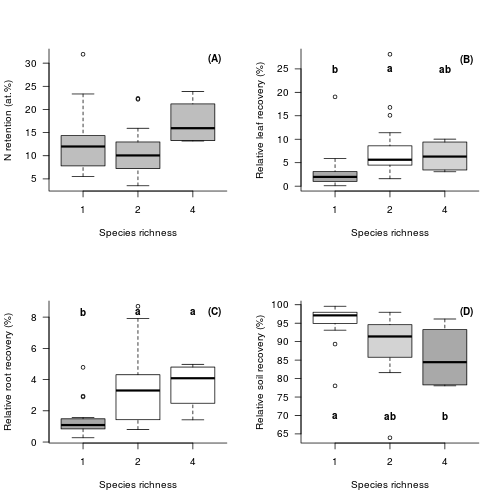

## Abstract 

We face a deluge of data scientists need to deal with in many different
disciplines today. While there are already good solutions to some parts of the
data life cycle the applicability of the solutions to certain scientific
domains often varies. Especially research domains with high degree of
interdisciplinary interactions and heterogeneity in methods and data in general
like ecology face problems in dealing with some valuable concepts like
ontologies that potentially can be used to improve or automate some of the most
common tasks in analyses like finding relevant data, cleaning and merging of
datasets. We here introduce the `rbefata` package that connects to the open
source data management platform `BEFdata` that has been developed and is used
within the BEF-China experiment. We show the use of the package in combination
with the portal using an example workflow that integrates three datasets from
the BEF-China experiment representing an analysis that has been published
already.  We discuss the combination of the R package `rbefdata` and the data
portal in the context of state of the art data management as well as we give an
outlook on upcoming features that will bring semantical features like smart
merges based on an ontology we created. 

## Introduction 

With a growing awareness on value of data, much effort has been put into
building data management platforms, to preserve all kind of environmental and
historic data, over the last years (e.g. diversity workbench, BEFdata). Many
specialized solutions for different scientific disciplines appeared that
provide data management plans for small scale projects or collaborations as
well as for large data producing long term or remote sensing projects. An
ongoing trend in that context is the development of integrative databases or
data portals. They serve as nodes that collect data from smaller databases of a
certain domain and they give researchers of that domain the opportunity to
access a wide range of relevant data all from one place. These data management
portals in fact offer a solution to to one of the most pressing problems that
we face with our valuable data today, their lost. 

Another big problem, especially in terms of reuse of available data, is the
general understanding of datasets. Usually plain datasets say nothing, to one
who is not familiar with it and they are even hard to decipher by the author
itself after some time has passed. It is usually hard to remember exactly what
methods have been used to collect a certain columns data or what the
abbreviations or headers in the dataset mean. To solve this problem metadata
frameworks have been developed and published as standards so nobody really
needs to think about an own set of requirements to describe its data. The
Ecological Metadata Language is only one example for that. While this
theoretically solves the problem with not well described datasets it is still
hard to make people use it extensively as this usually always means to learn
new tools that help with the description process (e.g morpho, data up).

While well described data can help a lot in understanding datasets and on
deciding upon the relevance and applicability in a certain analysis there is
still lots of manual intervention necessary after that to prepare the data for
analysis (cite yourself and Karin? or xxx). It may needs to be cleaned,
imputed, reshaped and merged which usually takes up to 70% of an analysis
workflow, before the smart models can be applied to the data to find
interesting patters (cite the workflow paper of Karin and me). This preparation
steps not only are time and labour intensive but also potentially error prone,
especially as the complexity of analyses grows. 

Ontologies, formal representations of knowledge, potentially offer a
sophisticated tool to deal with that step of data preparation (cite supporting
ecology as data intensive science). While they are already used in some
research domains like genetics (cite xxx, eg. http://www.geneontology.org/),
other domains face more problems using it (cite xxx, morpho team announced
semantic tagging but the plug-in did not appear anywhere). For example in
ecology, that has grown into a very collaborative, interdisciplinary and data
intensive science over the last decade, to address questions on a greater
temporal and spatial scale (e.g michener et al 2012).  The data here is mainly
provided by small scale studies spread all over the world (e.g heidorn2009
shedding light on the dark) but also through bigger long term projects like
LTER (cite xxx), BEF-China (cite xxx), governmental projects and local
initiatives (cite xxx).  This in fact results in a wild growing, complex and
heterogeneous data landscape that we need to deal with. The application of
ontologies in ecology is thus discussed controversially (cite xxx) and it is
argued that they can be a benefit, but it is hard to set up a sophisticated
ontology covering all necessary terms and relation of a that complex research
domain like ecology (cite xxx).

With growing global data pool there is a growing demand to use and reuse
available data and to embed small heterogeneous data into a wider context. We
here introduce the R package `rbefdata` that in combination with the `BEFdata`
data management platform exactly deals with that. We showcase the functionality
of the package available with version 0.3.5 creating a workflow that integrates
two datasets using an analysis that has been published already and discuss the
`rbefdata` package and `BEFdata` in the light of upcoming developments like the
integration of an ontology we built that will make finding data and smart
merges possible, to help researchers to deal with the future challenges in
handling complex and heterogeneous data.

## Material and Methods 

### BEF-China and the BEFdata portal

The BEF-China experiment is a Biodiversity Ecosystem Functioning (BEF)
experiment funded by the German science foundation (DFG, FOR 891). It is
located in the subtropics of China in the provinces Jianxi and Zhejiang. The
BEF-China research group (www.bef-china.de) uses two main research platforms.
An experimental forest diversity gradient of 50~ha, and 27 observational plots
of 30x30 m each located in the Gutianshan Nature Reserve.  The observational
plots were selected according to a crossed sampling design along tree species
richness and stand age. The data for the workflow on carbon pools stems from 22
to 116 years consisting of 14 to 35 species (cite Bruelheide, 2010).  

The [BEFdata](http://befdataproduction.biow.uni-leipzig.de/) portal is an open
source data management platform developed within the BEF-China project. It
adheres to standards like the Ecological Metadata Language for describing
datasets with metadata and is specialized in harmonizing small heterogeneous
data that usually has to be dealt with in BEF. But its specialization makes it
also very valuable to use in any other scientific domain that needs to deal
with complex small and heterogeneous data. 

The portal offers a social component where researchers can shop datasets and
write a paper proposals based on the datasets in the shopping cart. In the
process of creating a proposal some information like a title, a rationale, an
envisaged journal and date needs to be provided. Sending in a proposal a
researcher asks for access to the datasets and provides the data owners with
necessary information about the paper. The data owners then can decide if and
how they like to participate in the upcoming paper or if they only like to get
acknowledged for providing their data (cite Karin).

### The proposal

We use an already published dataset as an example to present the
functionalities and inter linkages between the BEF-China data portal and
`rbefdata`. To test the effect of species richness on system N retention and
tree sapling N uptake we conducted a 15N tracer experiment in a young tree
plantation. To this end, saplings of four abundant early successional tree
species have been planted in monoculture, in two- and four-species mixtures,
and as individual trees. Afforestations are increasing globally to produce
timber and pulp wood, but also to enhance ecosystem services such as carbon
sequestration, nutrient retention, or groundwater recharge. In order to further
optimise these services with regard to balanced nutrient (particularly
nitrogen) cycles, it is important to know whether the use of mixtures of native
tree species in afforestation projects promotes greater acquisition and
retention of nitrogen compared to the currently established large-scale
monoculture. 

Four species were chosen for the experiment: Schima superba Gardn. et Champ.
and Elaeocarpus decipiens Hemsley (evergreen), Quercus serrata Murray and
Castanea henryi (Skan) Rehd. et Wils. (deciduous; Yu et al. 2001). The
following planting schemes were established in 1-m² plots.  In each plot 16
saplings were planted in an array of four by four. Monocultures, two-species
combinations and four-species combinations were established. The four study
species provided a total of eleven species combinations four monocultures, six
two-species combinations, and one four-species combination. All treatments were
replicated four times, once in each of the four blocks. Pulse labelling with
15NH415NO3 (98% 15N) was performed in August and in September 2009. Leaf, fine
root and soil samples have been collected in September 2010. Samples have been
analysed for 15N content and leaf, fine root and soil recovery have been
calculated. The sum of the three compartment recoveries is referred to as
system N retention.  Relative leaf, root and soil recovery was calculated as
percentage of system N retention (for a detailed description of the material
and methods we refer to Lang et al. 2013). 

* figure shows the proposal page


### rbefdata 

The `rbefdata` package started its development within the BEF-Cina experiment.
Meanwhile it is part of the rOpenSci package portfolio (http://ropensci.org/),
which is a community driven approach to wrap all science APIs and to create
solutions to pull data from different repositories into R for analysis.  The
package can be installed from the CRAN package repository
(https://github.com/befdata/befdata) and enables access to the data, meta data
structures of the platform and provides convenient methods to pull single or
multiple dataset into the R environment in one step for analysis.  Additionally
it offers functions that help to upload final results datasets with the script
attached that has been used to derive the results from the original datasets
which provides a valuable insight into data provenance and also is a stepping
stone for reproducible research.

## Usecase (results)

The next step after an accepted paper proposal is to setup the `rbefdata`
package. This requires installing, loading the package and setting the required
package options. Having a look into the options list reveals several fields
that can be filled in, like the URL to the `BEFdata` server, user credentials
and a download folder name that is used to store free format files attached to
datasets. The `tematres` server related URLs in the options are part of
upcoming features that are non fully functional on the time of writing and thus
can be ignored by now. 

The most essential setting for the example workflow we present here is the user
credentials. These are used to authenticate the user against the portal to
ensure the access to the data has been granted before download and to log the
data access. Setting the server URL is not required here as it defaults to the
BEF-China project instance of the `BEFdata` portal that we retrieve data from
in this example. If one has set up an own instance of the `BEFdata` portal,
this URL needs to be changed so the package communicates with the right server
(see box below).


```r
require(rbefdata)
# options list
bef.options()
```

```
## $url
## [1] "http://china.befdata.biow.uni-leipzig.de"
## 
## $tematres_url
## [1] "http://tematres.befdata.biow.uni-leipzig.de/vocab/index.php"
## 
## $tematres_service_url
## [1] "http://tematres.befdata.biow.uni-leipzig.de/vocab/services.php"
## 
## $download_dir
## [1] "downloads"
## 
## $user_credentials
## [1] ""
```

```r

# querry single options
bef.options("url")
```

```
## [1] "http://china.befdata.biow.uni-leipzig.de"
```


```r
# set credentials example
bef.options(user_credentials = "aölkjspoiul12")
```


```r
# set URL example
bef.options(url = "http://my.own.befdata.instance.com")
```


After setup we can start right away using data from the proposal. The proposal
download function of `rbefdata` is used for that. It draws all associated
datasets of a proposal into the R environment in one single step. It returns a
list object that keeps a data frame per list element containing a dataset of
the proposal each (see blow). The function requires the ID of the proposal to
work. The ID can be found in the URL of the proposal (see blow).

```
# the proposal URL shows the id is 90 
http://befdataproduction.biow.uni-leipzig.de/paperproposals/90
```


```r
# proposal id is
datasets = bef.get.datasets_for_proposal(id = 90)
extract_first_dataset = datasets[[1]]
head(extract_first_dataset, 5)
```

```
##     plot_id recov_plot perleaf_plot perroot_plot perbio_plot
## 1 pilot1D01     15.642        2.918       1.0015       3.920
## 2 pilot1D02     13.032        5.523       1.3688       6.891
## 3 pilot1D04     20.292        1.057       0.5157       1.572
## 4 pilot1D05      9.595        4.187       1.0861       2.032
## 5 pilot1D07      8.354       15.100       5.0983      17.963
##   persoil_plot gbd_T0.mm.
## 1        96.08         NA
## 2        93.11      3.688
## 3        98.43      2.875
## 4        97.97      6.000
## 5        82.04      7.000
```


Each dataset in the BEFdata portal is associated with metadata. We also provide
access to the metadata from within `rbefdata`. It can be accessed either
directly via a metadata download command that takes the ID of a dataset or
extracted via the R internal `attributes()` command. The extraction is possible
as each dataset is attached with its metadata when using one of the download
commands of `rbefdata` (see box below).


```r
# get metadtata only, by dataset ID
bef.portal.get.metadata(dataset = 335)$title
```

```
## [1] "Competition of saplings for N -Pilot- system 15N retention"
```

```r

# extract title of first dataset in proposal
attributes(datasets[[1]])$title
```

```
## [1] "Competition of saplings for N -Pilot- system 15N retention"
```

```r

# extract all dataset titles in the proposal
titles = sapply(datasets, function(x) attributes(x)$title)
titles
```

```
## [1] "Competition of saplings for N -Pilot- system 15N retention"           
## [2] "Plottreatment and -location within the blocks of the Pilot-Experiment"
```

```r

# other metadata available
names(attributes(datasets[[1]]))
```

```
##  [1] "names"                    "class"                   
##  [3] "row.names"                "title"                   
##  [5] "abstract"                 "publicationDate"         
##  [7] "language"                 "creators"                
##  [9] "authors"                  "intellectualRights"      
## [11] "distribution"             "keywords"                
## [13] "generalTaxonomicCoverage" "samplingDescription"     
## [15] "spatial_coverage"         "temporal_coverage"       
## [17] "related_material"         "columns"
```


The dataset from the proposal were written into two variables called
`Nretention` and `design` before deciding upon how to merge. Inspecting both
dataset reveals each contains a column with a `plot_id` that is suitable for
merging. After merging the datasets the new synthesis dataset still contains
many column not required for the analysis that have been dropped. To analyse
the dataset of system N retention we require the information about species
diversity in the plots and the information about which plot is placed in which
block from the design dataset. 


```r
# extract into separate datasets
Nretention = datasets[[1]]
design = datasets[[2]]

# overview about the contents of the datasets
names(Nretention)
```

```
## [1] "plot_id"      "recov_plot"   "perleaf_plot" "perroot_plot"
## [5] "perbio_plot"  "persoil_plot" "gbd_T0.mm."
```

```r
names(design)
```

```
##  [1] "block"                    "x"                       
##  [3] "y"                        "plot_id"                 
##  [5] "control_ID"               "block_community_code"    
##  [7] "community_number"         "species_mixture"         
##  [9] "species_diversity"        "species_pool"            
## [11] "species_code"             "research_group_colour"   
## [13] "control"                  "closed_canopy"           
## [15] "density"                  "Natives"                 
## [17] "depth"                    "harvest"                 
## [19] "fungicide"                "inoculation"             
## [21] "pesticide"                "native"                  
## [23] "genetic_diverstiy"        "seed_addition"           
## [25] "fertilizer"               "plot_treatment_connected"
## [27] "sp1"                      "sp2"                     
## [29] "sp3"                      "sp4"                     
## [31] "sp5"                      "sp7"                     
## [33] "sp8"                      "sp11"                    
## [35] "sp_connected"
```


The response variables have been checked for normality with `qqplot` and
transformed where necessary (box below).


```r
# the synthesis dataset
syndata = merge(Nretention, design)

# overview about the content of the synthesis dataset
names(syndata)
```

```
##  [1] "plot_id"                  "recov_plot"              
##  [3] "perleaf_plot"             "perroot_plot"            
##  [5] "perbio_plot"              "persoil_plot"            
##  [7] "gbd_T0.mm."               "block"                   
##  [9] "x"                        "y"                       
## [11] "control_ID"               "block_community_code"    
## [13] "community_number"         "species_mixture"         
## [15] "species_diversity"        "species_pool"            
## [17] "species_code"             "research_group_colour"   
## [19] "control"                  "closed_canopy"           
## [21] "density"                  "Natives"                 
## [23] "depth"                    "harvest"                 
## [25] "fungicide"                "inoculation"             
## [27] "pesticide"                "native"                  
## [29] "genetic_diverstiy"        "seed_addition"           
## [31] "fertilizer"               "plot_treatment_connected"
## [33] "sp1"                      "sp2"                     
## [35] "sp3"                      "sp4"                     
## [37] "sp5"                      "sp7"                     
## [39] "sp8"                      "sp11"                    
## [41] "sp_connected"
```

```r

# restriction of the synthesis datset
syndata = syndata[-c(9:14, 16:41)]
names(syndata)
```

```
## [1] "plot_id"           "recov_plot"        "perleaf_plot"     
## [4] "perroot_plot"      "perbio_plot"       "persoil_plot"     
## [7] "gbd_T0.mm."        "block"             "species_diversity"
```

```r

# check for data properties (keep this?)
str(syndata)
```

```
## 'data.frame':	42 obs. of  9 variables:
##  $ plot_id          : Factor w/ 42 levels "pilot1D01","pilot1D02",..: 1 2 3 4 5 6 7 8 9 10 ...
##  $ recov_plot       : num  15.64 13.03 20.29 9.6 8.35 ...
##  $ perleaf_plot     : num  2.92 5.52 1.06 4.19 15.1 ...
##  $ perroot_plot     : num  1.001 1.369 0.516 1.086 5.098 ...
##  $ perbio_plot      : num  3.92 6.89 1.57 2.03 17.96 ...
##  $ persoil_plot     : num  96.1 93.1 98.4 98 82 ...
##  $ gbd_T0.mm.       : num  NA 3.69 2.88 6 7 ...
##  $ block            : Factor w/ 8 levels "1","2","3","4",..: 1 1 1 1 1 1 1 1 1 2 ...
##  $ species_diversity: int  1 1 1 2 2 2 2 2 4 1 ...
```

```r

# > we want to use 'species_diversity' as a factor

syndata$species_diversity = as.factor(syndata$species_diversity)
# attach(syndata)

### All response variables have been square root transformed

syndata$perroot_plot_t = syndata$perroot_plot^0.5
syndata$persoil_plot_t = syndata$persoil_plot^0.5
syndata$recov_plot_t = syndata$recov_plot^0.5
syndata$perleaf_plot_t = syndata$perleaf_plot^0.5
```


We analysed our data by linear mixed effects models. Since the plots are
clumped in space, we use block as a random factor we will use the R packages
(`nlme`) for model analysis and (`multcomp`) for post-hoc comparisons. To
adjust for an unbalanced experimental design, ANOVA Type II (package `car` (Fox
& Weisberg 2011)) was used to test for main effects 


```r
require(nlme)
require(multcomp)
require(car)
```


```r
### Model one Overall recovery/N retention
model1 = lme(recov_plot_t ~ gbd_T0.mm. + species_diversity, syndata, random = ~1 | 
    block, na.action = na.omit, method = "REML")
anova(model1)
```

```
##                   numDF denDF F-value p-value
## (Intercept)           1    34   870.6  <.0001
## gbd_T0.mm.            1    34     7.5  0.0098
## species_diversity     2    34     2.9  0.0714
```

```r
summary(glht(model1, linfct = mcp(species_diversity = "Tukey")))
```

```
## 
## 	 Simultaneous Tests for General Linear Hypotheses
## 
## Multiple Comparisons of Means: Tukey Contrasts
## 
## 
## Fit: lme.formula(fixed = recov_plot_t ~ gbd_T0.mm. + species_diversity, 
##     data = syndata, random = ~1 | block, method = "REML", na.action = na.omit)
## 
## Linear Hypotheses:
##            Estimate Std. Error z value Pr(>|z|)  
## 2 - 1 == 0   -0.378      0.251   -1.51    0.280  
## 4 - 1 == 0    0.478      0.420    1.14    0.482  
## 4 - 2 == 0    0.857      0.399    2.15    0.077 .
## ---
## Signif. codes:  0 '***' 0.001 '**' 0.01 '*' 0.05 '.' 0.1 ' ' 1
## (Adjusted p values reported -- single-step method)
```

```r

# ANOVA type II test for unbalanced design
model1c = Anova(model1, type = "II")
model1c
```

```
## Analysis of Deviance Table (Type II tests)
## 
## Response: recov_plot_t
##                   Chisq Df Pr(>Chisq)   
## gbd_T0.mm.         7.42  1     0.0064 **
## species_diversity  5.71  2     0.0576 . 
## ---
## Signif. codes:  0 '***' 0.001 '**' 0.01 '*' 0.05 '.' 0.1 ' ' 1
```

```r

# model evaluation plot(model1,resid(.)~fitted(.))
# plot(model1,recov_plot_t~fitted(.))

## Model2 percentage leaf recovery of plot recovery
model2 = lme(perleaf_plot_t ~ species_diversity, syndata, random = ~1 | 
    block, method = "REML")
anova(model2)
```

```
##                   numDF denDF F-value p-value
## (Intercept)           1    36  273.06  <.0001
## species_diversity     2    36    6.56  0.0037
```

```r
summary(glht(model2, linfct = mcp(species_diversity = "Tukey")))
```

```
## 
## 	 Simultaneous Tests for General Linear Hypotheses
## 
## Multiple Comparisons of Means: Tukey Contrasts
## 
## 
## Fit: lme.formula(fixed = perleaf_plot_t ~ species_diversity, data = syndata, 
##     random = ~1 | block, method = "REML")
## 
## Linear Hypotheses:
##            Estimate Std. Error z value Pr(>|z|)    
## 2 - 1 == 0    1.053      0.293    3.59   <0.001 ***
## 4 - 1 == 0    0.865      0.497    1.74     0.18    
## 4 - 2 == 0   -0.188      0.479   -0.39     0.92    
## ---
## Signif. codes:  0 '***' 0.001 '**' 0.01 '*' 0.05 '.' 0.1 ' ' 1
## (Adjusted p values reported -- single-step method)
```

```r
Anova(model2, type = "II")
```

```
## Analysis of Deviance Table (Type II tests)
## 
## Response: perleaf_plot_t
##                   Chisq Df Pr(>Chisq)   
## species_diversity  13.1  2     0.0014 **
## ---
## Signif. codes:  0 '***' 0.001 '**' 0.01 '*' 0.05 '.' 0.1 ' ' 1
```

```r

# model evaluation plot(model2,resid(.)~fitted(.))
# plot(model2,perleaf_plot_t~fitted(.))

## Model3 percentage root recovery of overall recovery
model3 = lme(perroot_plot_t ~ species_diversity, syndata, random = ~1 | 
    block, method = "REML")
anova(model3)
```

```
##                   numDF denDF F-value p-value
## (Intercept)           1    36   374.2  <.0001
## species_diversity     2    36     7.2  0.0024
```

```r
summary(glht(model3, linfct = mcp(species_diversity = "Tukey")))
```

```
## 
## 	 Simultaneous Tests for General Linear Hypotheses
## 
## Multiple Comparisons of Means: Tukey Contrasts
## 
## 
## Fit: lme.formula(fixed = perroot_plot_t ~ species_diversity, data = syndata, 
##     random = ~1 | block, method = "REML")
## 
## Linear Hypotheses:
##            Estimate Std. Error z value Pr(>|z|)    
## 2 - 1 == 0    0.601      0.170    3.53   <0.001 ***
## 4 - 1 == 0    0.733      0.288    2.54    0.028 *  
## 4 - 2 == 0    0.132      0.278    0.48    0.879    
## ---
## Signif. codes:  0 '***' 0.001 '**' 0.01 '*' 0.05 '.' 0.1 ' ' 1
## (Adjusted p values reported -- single-step method)
```

```r
Anova(model3, type = "II")
```

```
## Analysis of Deviance Table (Type II tests)
## 
## Response: perroot_plot_t
##                   Chisq Df Pr(>Chisq)    
## species_diversity  14.3  2    0.00077 ***
## ---
## Signif. codes:  0 '***' 0.001 '**' 0.01 '*' 0.05 '.' 0.1 ' ' 1
```

```r

# model evaluation plot(model3,resid(.)~fitted(.))
# plot(model3,perleaf_plot_t~fitted(.))

## Model 4 percentage soil recovery of overall recovery
model4 = lme(persoil_plot_t ~ species_diversity, syndata, random = ~1 | 
    block, method = "REML")
anova(model4)
```

```
##                   numDF denDF F-value p-value
## (Intercept)           1    36   26248  <.0001
## species_diversity     2    36       4  0.0274
```

```r
summary(glht(model4, linfct = mcp(species_diversity = "Tukey")))
```

```
## 
## 	 Simultaneous Tests for General Linear Hypotheses
## 
## Multiple Comparisons of Means: Tukey Contrasts
## 
## 
## Fit: lme.formula(fixed = persoil_plot_t ~ species_diversity, data = syndata, 
##     random = ~1 | block, method = "REML")
## 
## Linear Hypotheses:
##            Estimate Std. Error z value Pr(>|z|)  
## 2 - 1 == 0   -0.294      0.127   -2.32     0.05 .
## 4 - 1 == 0   -0.499      0.215   -2.33     0.05 *
## 4 - 2 == 0   -0.205      0.207   -0.99     0.57  
## ---
## Signif. codes:  0 '***' 0.001 '**' 0.01 '*' 0.05 '.' 0.1 ' ' 1
## (Adjusted p values reported -- single-step method)
```

```r
Anova(model4, type = "II")
```

```
## Analysis of Deviance Table (Type II tests)
## 
## Response: persoil_plot_t
##                   Chisq Df Pr(>Chisq)  
## species_diversity  7.96  2      0.019 *
## ---
## Signif. codes:  0 '***' 0.001 '**' 0.01 '*' 0.05 '.' 0.1 ' ' 1
```

```r

# model evalution plot(model4,resid(.)~fitted(.))
# plot(model4,perleaf_plot_t~fitted(.))
```


 


* caption: 

## Discussion

* General discussion 
  - high need to effective use/reuse data 
  - relevant data needs to be simply detectable 

* BEFdata and rbefdata 
  - in combination provide a solution to 
    + data storage
    + describing data with metadata
    + collaboration and data sharing 
    + simply pull data into analysis software and push data back
    + data provenance by attaching R scripts to uploads
  - will provide solution with next versions 
    + easier finding relevant data 
    + smart merges (including unit conversions)

As there is a growing demand to effectively reuse available data this puts much
pressure on the development of solutions that help researchers not only to find
but also to integrate heterogeneous small data into a wider context in
different analyses (cite xxx, data intensive science, long tail). The
combination of `BEFdata` and the `rbefdata` package provides a solutions to a
one part of the data life cycle and especially introduces a solution to deal
with high heterogeneous data.

We recently stared to develop an ontology using a `tematres` server containing
knowledge extracted from portals that deal with data management for ecological
research. The `tematres` server offers an API so all the contained terms can be
accessed by the upcoming version of `rbefdata` 

The formalization developed is and will be based on the knowledge used in
biodiversity research. Thus we will here discuss the software combination
`BEFdata` and `rbefdata` in the light of the upcoming features and in general
context state of the art data management today. In one of the next versions to
be rolled out the `BEFdata` portal will get a semantical annotation feature.
This will give administrators the ability to tag each column of datasets with a
general term that best describes the content. So the field will contain
potential top terms of the ontology. The tagging will be reflected in the API
and can thus be simply queried to use the information within the R package.
Using the knowledge about the content of a column in the R package will enable
us to do support smart merges that work.

`tematres` ([homepage](http://www.vocabularyserver.com/))into BEFdata and the
rbefdata package so they play well together semantically.

## Acknowledgements 

Thanks to all the data owners of the proposal for providing access to the
datasets. ...

## Literature

This will be done externally as markdown has no good way to deal with
references and stuff. We can collect here a list of links to references. I will
then collect them with e.g zotero to export a format we can hand them in for
publication.

## Appendix

* maybe will not be used extensively but we will see

### Figures 

* vizualization plugin (keywords) 

One can visualize the keywords associated with the dataset of a BEFdata portal
using the vitalization functionality. This gives a short overview about the
contents the portal data is dealing with.


```
## Warning: stem morphology could not be fit on page. It will not be
## plotted. Warning: arbuscular mycorrhizal fungi could not be fit on
## page. It will not be plotted. Warning: crown architecture could not
## be fit on page. It will not be plotted. Warning: individual based
## values could not be fit on page. It will not be plotted. Warning:
## kinetic energy could not be fit on page. It will not be plotted.
## Warning: tree performance could not be fit on page. It will not be
## plotted. Warning: wood parenchym could not be fit on page. It will
## not be plotted. Warning: air temperature could not be fit on page. It
## will not be plotted. Warning: belowground biomass could not be fit on
## page. It will not be plotted. Warning: cadmium at wavelength 214nm
## could not be fit on page. It will not be plotted. Warning: cadmium at
## wavelength 228nm could not be fit on page. It will not be plotted.
## Warning: cation exchange capacity could not be fit on page. It will
## not be plotted. Warning: data management could not be fit on page. It
## will not be plotted. Warning: diversity treatment could not be fit on
## page. It will not be plotted. Warning: experimental design could not
## be fit on page. It will not be plotted. Warning: geomorphology could
## not be fit on page. It will not be plotted. Warning: microbial
## biomass could not be fit on page. It will not be plotted. Warning:
## secondary compounds could not be fit on page. It will not be plotted.
## Warning: spatial genetic structure could not be fit on page. It will
## not be plotted. Warning: species trait could not be fit on page. It
## will not be plotted. Warning: spiders could not be fit on page. It
## will not be plotted. Warning: standard deviation could not be fit on
## page. It will not be plotted. Warning: stem break could not be fit on
## page. It will not be plotted. Warning: trait dissimilarity could not
## be fit on page. It will not be plotted. Warning: wood compression
## could not be fit on page. It will not be plotted. Warning: wood
## shearing could not be fit on page. It will not be plotted. Warning:
## wood shrinkage could not be fit on page. It will not be plotted.
## Warning: wood stretching could not be fit on page. It will not be
## plotted. Warning: wood toughness could not be fit on page. It will
## not be plotted. Warning: aboveground biomass could not be fit on
## page. It will not be plotted. Warning: aeromorphic organic layer
## could not be fit on page. It will not be plotted. Warning:
## ammonification could not be fit on page. It will not be plotted.
## Warning: cavity nesting hymenoptera could not be fit on page. It will
## not be plotted. Warning: coarse root density could not be fit on
## page. It will not be plotted. Warning: community similarity could not
## be fit on page. It will not be plotted. Warning: community weighted
## mean trait could not be fit on page. It will not be plotted. Warning:
## control treatment could not be fit on page. It will not be plotted.
## Warning: dispersal could not be fit on page. It will not be plotted.
## Warning: eco-physiologic traits could not be fit on page. It will not
## be plotted. Warning: ecosystem functioning could not be fit on page.
## It will not be plotted. Warning: forest canopy could not be fit on
## page. It will not be plotted. Warning: genetic autocorrelation could
## not be fit on page. It will not be plotted. Warning: haplotype could
## not be fit on page. It will not be plotted. Warning: hunting type
## could not be fit on page. It will not be plotted. Warning: land use
## history could not be fit on page. It will not be plotted. Warning:
## leaf longevity could not be fit on page. It will not be plotted.
## Warning: litter thickness could not be fit on page. It will not be
## plotted. Warning: matching status could not be fit on page. It will
## not be plotted. Warning: mineralisation could not be fit on page. It
## will not be plotted. Warning: mixed models could not be fit on page.
## It will not be plotted. Warning: multi-trophic interactions could not
## be fit on page. It will not be plotted. Warning: nitrogen cycling
## could not be fit on page. It will not be plotted. Warning: non-random
## extinction could not be fit on page. It will not be plotted. Warning:
## phylogenetic distinctness could not be fit on page. It will not be
## plotted. Warning: phytophagous insects could not be fit on page. It
## will not be plotted. Warning: position could not be fit on page. It
## will not be plotted. Warning: rainfall simulator could not be fit on
## page. It will not be plotted. Warning: research proposals could not
## be fit on page. It will not be plotted. Warning: rooting depth could
## not be fit on page. It will not be plotted. Warning: shrub layer
## could not be fit on page. It will not be plotted. Warning: simpson
## diversity could not be fit on page. It will not be plotted. Warning:
## snag height could not be fit on page. It will not be plotted.
## Warning: social status could not be fit on page. It will not be
## plotted. Warning: specialization could not be fit on page. It will
## not be plotted. Warning: species identity variable could not be fit
## on page. It will not be plotted. Warning: topography could not be fit
## on page. It will not be plotted. Warning: vegetation stratum could
## not be fit on page. It will not be plotted. Warning: wood ground
## tissue could not be fit on page. It will not be plotted. Warning:
## wood porosity could not be fit on page. It will not be plotted.
```

 


### Tables
