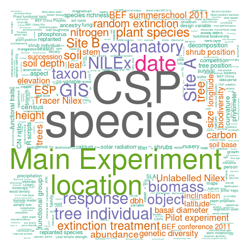

## Abstract 

We face a deluge of data today scientists need to deal with in many different
disciplines. While there are already good solutions to some parts of the data
life cycle the applicability of the solutions to certain scientific domains
often varies. Especially research domains with high degree of interdisciplinary
interactions and heterogeneity in methods and data like ecology face problems
in dealing with valuable concepts like ontologies that potentially can be used
to improve or automate some of the most common tasks in analyses like finding
relevant data, cleaning and merging of datasets. We here introduce the
`rbefata` package that connects to the open source data management platform
`BEFdata` that has been developed and is used within the BEF-China experiment.
We show how to use the package in combination with the data portal on an
example workflow that integrates two datasets from the BEF-China experiment
representing an analysis that has been published already. We discuss the
combination of the R package `rbefdata` and the data portal in the context of
state of the art data management and the data lifecycle as well as we give an
outlook on upcoming features like semantical tools that will enable smart
merges and finding of data based on an ontology we are building. 

## Introduction 

With a growing awareness on the value of data, much effort has been put into
building data management platforms, to preserve all kind of environmental and
historic data, over the last years (e.g. diversity workbench, GBIF, `BEFdata`).
Many solutions for different scientific disciplines appeared that provide data
management plans for small scale projects or collaborations as well as for
large data producing long term or remote sensing projects. An ongoing trend in
that context is the development of integrative databases or data portals. They
serve as nodes that collect data from smaller databases of a certain domain and
they give researchers of that domain the opportunity to access a wide range of
relevant data all from one place. These data management portals in fact offer a
solution to to one of the most pressing problems that we face with our valuable
data today, their lost. 

With a growing global data pool there is a also a growing demand to use and
reuse available data and to embed small heterogeneous data into a wider
context. A problem here is the general understanding of datasets. Usually plain
datasets say nothing, to one who is not familiar with it and they are even hard
to decipher by the author itself after some time has passed. It is usually hard
to remember exactly what methods have been used to collect a certain columns
data or what the abbreviations or headers in the dataset mean. To solve this
problem metadata frameworks have been developed and published as standards so
nobody really needs to think about an own set of requirements to describe its
data. The Ecological Metadata Language is only one example for that. While this
theoretically solves the problem with not well described datasets it is still
hard to make researchers use it extensively as this usually always means to
learn new tools that help with the description process (e.g morpho, data up).

While well described data can help a lot in understanding datasets and on
deciding upon the relevance and applicability in a certain analysis there is
still lots of manual intervention necessary after that to prepare the data for
analysis (cite yourself and Karin? or xxx). It may needs to be cleaned,
imputed, reshaped and merged which usually takes up to 70% of an analysis
workflow, before smart models can be applied to the data to find interesting
patters (cite the workflow paper of Karin and me). This preparation steps not
only are time and labour intensive but also potentially error prone, especially
as the complexity of analyses grows. 

Ontologies, as formal representations of knowledge, potentially offer a
sophisticated tool to deal with that step of data preparation (cite supporting
ecology as data intensive science). While they are already used in some
research domains like genetics (cite xxx, eg. http://www.geneontology.org/),
other domains face more problems using it (cite xxx, morpho team announced
semantic tagging but the plug-in did not appear anywhere). The application of
ontologies in ecology is discussed controversially (cite xxx) and it is argued
that they can be a huge benefit, but it is hard to set up a sophisticated
ontology covering all necessary terms and relation of a highly complex research
domains (cite xxx). 

For example ecology, which has grown into a very collaborative,
interdisciplinary and data intensive science over the last decade, to address
questions on a greater temporal and spatial scale (e.g michener et al 2012).
The data here is mainly provided by small scale studies spread all over the
world (e.g heidorn2009 shedding light on the dark) but also through bigger long
term projects like LTER (cite xxx), BEF-China (cite xxx), governmental projects
and local initiatives (cite xxx) and private persons. This in fact results in a
wild growing, complex and heterogeneous data landscape that an ontology would
need to capture to be usable.

We here introduce the R package `rbefdata` that in combination with the
`BEFdata` data management platform deals with finding, analysing and describing
data as well the reuse of availbale data. We showcase the functionality of the
package available with version `0.3.5` creating a workflow which integrates two
datasets and reconstructs one facet of an analysis that has been published
already. We discuss the `rbefdata` package and `BEFdata` in the light of
upcoming developments like the integration of an ontology we built that will
make finding data and smart merges possible, to help researchers to deal with
the future challenges in handling complex and heterogeneous data.

## Material and Methods 

### BEF-China and the BEFdata portal

The BEF-China experiment is a Biodiversity Ecosystem Functioning (BEF)
experiment funded by the German science foundation (DFG, FOR 891). It is
located in the subtropics of China in the provinces Jianxi and Zhejiang. The
BEF-China research group (www.bef-china.de) uses two main research platforms.
An experimental forest diversity gradient of 50~ha, and 27 observational plots
of 30x30 m each located in the Gutianshan Nature Reserve.  The observational
plots were selected according to a crossed sampling design along tree species
richness and stand age. The data for the workflow on carbon pools stems from 22
to 116 years consisting of 14 to 35 species (cite Bruelheide, 2010).  

The [BEFdata](http://befdataproduction.biow.uni-leipzig.de/) portal is an open
source data management platform developed within the BEF-China project. It
adheres to standards like the Ecological Metadata Language for describing
datasets with metadata and is specialized in harmonizing small heterogeneous
data that usually has to be dealt with in BEF. But its specialization makes it
also very valuable to use in any other scientific domain that needs to deal
with complex small and heterogeneous data. 

The portal offers a social component where researchers can shop datasets and
write a paper proposals based on the datasets in the shopping cart. In the
process of creating a proposal some information like a title, a rationale, an
envisaged journal and date needs to be provided. Sending in a proposal a
researcher asks for access to the datasets and provides the data owners with
necessary information about the paper. The data owners then can decide if and
how they like to participate in the upcoming paper or if they only like to get
acknowledged for providing their data (cite Karin).

### The proposal 

The portal facilitates research cooperation by the tool of paper proposals.
Sending in a proposal, a researcher asks for access to the datasets and
proposes his/her research idea to the dataowners and possible collaborators.
This more social component of the portal allows to include and acknowledge all
researchers involved in the data sampling process, promotes collaborations
between research units, avoids publication initiatives of the same research
ideas and adds to the transparency of data publication.  To create a paper
proposal the researcher can shop (select) datasets which are to be included in
the analyses.  Furthermore basic information of the proposed paper such as the
title, the rationale, the envisaged journal and date needs to be provided. The
data owners and proposed collaborators are informed and can decide if and how
they like to participate in the upcoming paper or if they only like to get
acknowledged for providing their data (cite Karin). Furthermore the datasets
assembled by the paper proposal can be readily imported in one step to the R
environment by rbefdata.


### rbefdata 

The development of the `rbefdata` package started within the BEF-China project.
Meanwhile it is part of the rOpenSci package portfolio (http://ropensci.org/),
which is a community driven approach to wrap all science APIs and to create
solutions to pull data from different repositories into R for analysis.  The
package can be installed from the CRAN package repository
(https://github.com/befdata/befdata) and enables access to the data, meta data
structures of the platform and provides convenient methods to pull single or
multiple dataset into the R environment in one step for analysis.  Additionally
it offers functions that help to upload final results datasets with the script
attached that has been used to derive the results from the original datasets
which provides a valuable insight into data provenance and also is a stepping
stone for reproducible research.

## Usecase (results) 

In this paper we use an already published dataset as a usecase to present the
functionalities and inter linkages between the BEF-China data portal and
`rbefdata`. However, we will as well give some ecological background of the
datasets used and the respective analyses. The usecase is dealing with data
from a small scale experiment called pilot experiment. It is a 15N tracer
experiment which aims to disentangle the effect of species mixtures on system N
retention.

We created a paper proposal with the following rationale: 'Knowledge of
biodiversity effects on nutrient cycling patterns in subtropical forest
ecosystems is still very limited, particularly as regards macronutrients such
as nitrogen and phosphorus. Experimental approaches using tree saplings may
promote an understanding of mechanisms that underlie nutrient acquisition and
cycling in early successional stages of secondary forests and forest
plantations.  Insights in the potential of nutrient retention of young tree
plantations are of particular interest in China, where large areas have been
reforested in order to counteract soil erosion and to increase the soils’ water
and nutrient retention capacity.  In this study we planted saplings of four
abundant early successional (evergreen and deciduous) tree species in
monocultures, two- and four-species combination to test the effect of species
richness on nitrogen acquisition and retention by using a 15N tracer
experiment.  A crucial question in BEF research is the appropriate time scale
of experiments which allows species richness effects to emerge. This question
gains importance when long-lived and slowly growing organisms such as trees are
considered. We wanted to analyse whether species richness effects occur during
the establishment phase of early successional tree species typical of
subtropical forests of China.  More precisely we wanted to test the following
hypotheses: (H1) Nitrogen acquisition and retention increases with species
richness due complementary effects in species mixtures.  (H2) Species richness
effects strengthen over time.' The respective proposal can be assessed under
(url) For a detailed description of the experimental design we refer to Lang et
al. 2013 (DOI) 

 

* caption: The paper proposal in its final approved state. The information on that page
           contains a title rational envisaged date and journal. The calculated authors
           and email lists for communication as well as the attached datasets and sub
           projects involved (only partially shown).

When all dataowners accepted the paper proposal rbefdata can be used to
directly access the datasets from the dataportal and transfer them to the R
environment. To do so the `rbefdata`package needs to be setup. This requires
installing, loading the package and setting the required package options.
Having a look into the options list reveals several fields that can be filled
in, like the URL to the `BEFdata` server, user credentials and a download
folder name that is used to store free format files attached to datasets. The
`tematres` server related URLs in the options are part of upcoming features
that are non fully functional on the time of writing and thus can be ignored by
now. 

The most essential setting for the example workflow we present here is the user
credentials. These are used to authenticate the user against the portal to
ensure the access to the data has been granted before download and to log the
data access. Setting the server URL is not required here as it defaults to the
BEF-China project instance of the `BEFdata` portal that we retrieve data from
in this example. If one has set up an own instance of the `BEFdata` portal,
this URL needs to be changed so the package communicates with the right server
(see box below).


```r
require(rbefdata)
# options list
bef.options()
```

```
## $url
## [1] "http://china.befdata.biow.uni-leipzig.de"
## 
## $tematres_url
## [1] "http://tematres.befdata.biow.uni-leipzig.de/vocab/index.php"
## 
## $tematres_service_url
## [1] "http://tematres.befdata.biow.uni-leipzig.de/vocab/services.php"
## 
## $download_dir
## [1] "downloads"
## 
## $user_credentials
## [1] ""
```

```r

# querry single options
bef.options("url")
```

```
## [1] "http://china.befdata.biow.uni-leipzig.de"
```


```r
# set credentials example
bef.options(user_credentials = "aölkjspoiul12")
```


```r
# set URL example
bef.options(url = "http://my.own.befdata.instance.com")
```


After setup we can start right away using data from the proposal that we
created. The proposal download function of `rbefdata` is used for that. It
draws all associated datasets of a proposal into the R environment in one
single step. It returns a list object that keeps a data frame per list element
containing a dataset of the proposal each (see blow). The function requires the
ID of the proposal to work. The ID can be found in the URL of the proposal (see
below).

```
# the proposal URL shows the id is 90 
http://befdataproduction.biow.uni-leipzig.de/paperproposals/90
```


```r
# proposal id is
datasets = bef.get.datasets_for_proposal(id = 90)
extract_second_dataset = datasets[[2]]
head(extract_first_dataset, 5)
```

```
## Error: object 'extract_first_dataset' not found
```


Each dataset in the `BEFdata` portal is associated with metadata the authors of
the dataset provide. We also provide access to the metadata from within
`rbefdata`. It can be accessed either directly via a metadata download command
that takes the ID of a dataset or extracted via the R internal `attributes()`
command. The extraction via attributes is possible as each dataset is attached
with its metadata when using one of the download commands of `rbefdata` (see
box below).


```r
# get metadata only, by dataset ID
bef.portal.get.metadata(dataset = 335)$title
```

```
## [1] "Competition of saplings for N -Pilot- system 15N retention"
```

```r

# extract title of first dataset in proposal
attributes(datasets[[1]])$title
```

```
## [1] "Competition of saplings for N -Pilot- 15N recovery in leaves and fine roots "
```

```r

# extract all dataset titles in the proposal
titles = sapply(datasets, function(x) attributes(x)$title)
titles
```

```
## [1] "Competition of saplings for N -Pilot- 15N recovery in leaves and fine roots "
## [2] "Competition of saplings for N -Pilot- system 15N retention"                  
## [3] "Plottreatment and -location within the blocks of the Pilot-Experiment"
```

```r

# other metadata available
names(attributes(datasets[[1]]))
```

```
##  [1] "names"                    "class"                    "row.names"               
##  [4] "title"                    "abstract"                 "publicationDate"         
##  [7] "language"                 "creators"                 "authors"                 
## [10] "intellectualRights"       "distribution"             "keywords"                
## [13] "generalTaxonomicCoverage" "samplingDescription"      "spatial_coverage"        
## [16] "temporal_coverage"        "related_material"         "columns"
```


The dataset from the proposal contains three datasets, of which we do only use
the second and third. These two are written into two variables called
`Nretention` and `design` before deciding upon how to merge them. Inspecting
the headers of both dataset reveals each of them contains a column containing a
`plot_id` that seems suitable for merging. But we can also make use the
metadata for columns to check if this really is the case (see box below).


```r
# extract into separate datasets
Nretention = datasets[[2]]
design = datasets[[3]]

# overview about the contents of the datasets

# names in dataset Nretention
names(Nretention)
```

```
## [1] "plot_id"      "recov_plot"   "perleaf_plot" "perroot_plot" "perbio_plot"  "persoil_plot"
## [7] "gbd_T0.mm."
```

```r

# description of column plot_id
Nretention_column_plot_id_description = attributes(Nretention)$columns[1, ]$description
Nretention_column_plot_id_description
```

```
## [1] "Reasearch plots of the Biodiversity - Ecosystem functioning experiment (BEF-China). There are three main sites for research plots in the BEF Experiment: Comparative Study Plots (CSP) in the  Gutianshan Nature Reserve, having a size of 30x30m^2, measured on the ground. Main Experiment plots have a size of 1 mu, which is about 25x25m^2 in horizontal projection. Pilot Study Plots have a size of 1x1 m^2.  \nResearch plots on the main experiment have a \"p\" in front of their IDs and then a 6 digit code: Plots in the main sites A and B are named according to their position in the original spreadsheet, in which they were designed.  They consist of 6 digits: _1st digit_: Site (1:A, 2:B), _digit 2and3_: southwards row: as in spreadsheets the rows are named from the top to the bottom; _digit 4 and 5_: westward column: as in the original spreadsheet, but the letters are converted to numbers (A=01, B=02); _6th digit_: indicator, if the plot has been shifted a quarter mu.  Example: \"p205260\": \"p\" means that this is a plot that is specified.  \"2\" means, that we are at site B.  Now the coordinates of the south - west corner: \"0526\".  Since \"e\" is the fifth letter of the alphabet, this is Plot E26.   The last digit \"0\" means that this plot was not moved by a quarter of a Mu, as some sites in Site A. The 6th digit can also indicate the subplot within the plot. \"5\", \"6\", \"7\", \"8\" indicate the northwest, northeast, southeast, and southwest quarter plot respectively. (plot_id: plot_id; Datagroup description: Reasearch plots of the Biodiversity - Ecosystem functioning experiment (BEF-China). There are three main sites for research plots in the BEF Experiment: Comparative Study Plots (CSP) in the  Gutianshan Nature Reserve, having a size of 30x30m^2, measured on the ground. Main Experiment plots have a size of 1 mu, which is about 25x25m^2 in horizontal projection. Pilot Study Plots have a size of 1x1 m^2.  \nResearch plots on the main experiment have a \"p\" in front of their IDs and then a 6 digit code: Plots in the main sites A and B are named according to their position in the original spreadsheet, in which they were designed.  They consist of 6 digits: _1st digit_: Site (1:A, 2:B), _digit 2and3_: southwards row: as in spreadsheets the rows are named from the top to the bottom; _digit 4 and 5_: westward column: as in the original spreadsheet, but the letters are converted to numbers (A=01, B=02); _6th digit_: indicator, if the plot has been shifted a quarter mu.  Example: \"p205260\": \"p\" means that this is a plot that is specified.  \"2\" means, that we are at site B.  Now the coordinates of the south - west corner: \"0526\".  Since \"e\" is the fifth letter of the alphabet, this is Plot E26.   The last digit \"0\" means that this plot was not moved by a quarter of a Mu, as some sites in Site A. The 6th digit can also indicate the subplot within the plot. \"5\", \"6\", \"7\", \"8\" indicate the northwest, northeast, southeast, and southwest quarter plot respectively.)"
```

```r

# names in dataset Nretention
names(design)
```

```
##  [1] "block"                    "x"                        "y"                       
##  [4] "plot_id"                  "control_ID"               "block_community_code"    
##  [7] "community_number"         "species_mixture"          "species_diversity"       
## [10] "species_pool"             "species_code"             "research_group_colour"   
## [13] "control"                  "closed_canopy"            "density"                 
## [16] "Natives"                  "depth"                    "harvest"                 
## [19] "fungicide"                "inoculation"              "pesticide"               
## [22] "native"                   "genetic_diverstiy"        "seed_addition"           
## [25] "fertilizer"               "plot_treatment_connected" "sp1"                     
## [28] "sp2"                      "sp3"                      "sp4"                     
## [31] "sp5"                      "sp7"                      "sp8"                     
## [34] "sp11"                     "sp_connected"
```

```r

design_column_plot_id_description = attributes(design)$columns[4, ]$description
design_column_plot_id_description
```

```
## [1] "Reasearch plots of the Biodiversity - Ecosystem functioning experiment (BEF-China). There are three main sites for research plots in the BEF Experiment: Comparative Study Plots (CSP) in the  Gutianshan Nature Reserve, having a size of 30x30m^2, measured on the ground. Main Experiment plots have a size of 1 mu, which is about 25x25m^2 in horizontal projection. Pilot Study Plots have a size of 1x1 m^2.  \nResearch plots on the main experiment have a \"p\" in front of their IDs and then a 6 digit code: Plots in the main sites A and B are named according to their position in the original spreadsheet, in which they were designed.  They consist of 6 digits: _1st digit_: Site (1:A, 2:B), _digit 2and3_: southwards row: as in spreadsheets the rows are named from the top to the bottom; _digit 4 and 5_: westward column: as in the original spreadsheet, but the letters are converted to numbers (A=01, B=02); _6th digit_: indicator, if the plot has been shifted a quarter mu.  Example: \"p205260\": \"p\" means that this is a plot that is specified.  \"2\" means, that we are at site B.  Now the coordinates of the south - west corner: \"0526\".  Since \"e\" is the fifth letter of the alphabet, this is Plot E26.   The last digit \"0\" means that this plot was not moved by a quarter of a Mu, as some sites in Site A. The 6th digit can also indicate the subplot within the plot. \"5\", \"6\", \"7\", \"8\" indicate the northwest, northeast, southeast, and southwest quarter plot respectively. (plot_id: Individual complex ID for identifying exactly each plot; it connects with underline character the block number and the community code, i. e. the block number with the plots treatment. The plot identifier contains the information, which block the plot is in and which community is is comprised of.)"
```


After merging the datasets the new synthesis dataset still contains many
columns not required for the analysis that can be dropped. To analyse the
dataset of system N retention we need information about the species diversity
in the plots and about which plot is placed in which block from the design
dataset. 'Species diversity' is used as a factor containing three levels (1,2,4
species mixtures). The response variables have been checked for normality with
`qqplot` and transformed (box below).


```r
# the synthesis dataset
syndata = merge(Nretention, design)

# overview about the content of the synthesis dataset
names(syndata)
```

```
##  [1] "plot_id"                  "recov_plot"               "perleaf_plot"            
##  [4] "perroot_plot"             "perbio_plot"              "persoil_plot"            
##  [7] "gbd_T0.mm."               "block"                    "x"                       
## [10] "y"                        "control_ID"               "block_community_code"    
## [13] "community_number"         "species_mixture"          "species_diversity"       
## [16] "species_pool"             "species_code"             "research_group_colour"   
## [19] "control"                  "closed_canopy"            "density"                 
## [22] "Natives"                  "depth"                    "harvest"                 
## [25] "fungicide"                "inoculation"              "pesticide"               
## [28] "native"                   "genetic_diverstiy"        "seed_addition"           
## [31] "fertilizer"               "plot_treatment_connected" "sp1"                     
## [34] "sp2"                      "sp3"                      "sp4"                     
## [37] "sp5"                      "sp7"                      "sp8"                     
## [40] "sp11"                     "sp_connected"
```

```r

# remove unwanted variables from synthesis datset
syndata = syndata[-c(9:14, 16:41)]
names(syndata)
```

```
## [1] "plot_id"           "recov_plot"        "perleaf_plot"      "perroot_plot"     
## [5] "perbio_plot"       "persoil_plot"      "gbd_T0.mm."        "block"            
## [9] "species_diversity"
```

```r

# > we want to use 'species_diversity' as a factor
syndata$species_diversity = as.factor(syndata$species_diversity)

# square root transforme response variables
syndata$recov_plot_t = syndata$recov_plot^0.5
syndata$perleaf_plot_t = syndata$perleaf_plot^0.5
syndata$perroot_plot_t = syndata$perroot_plot^0.5
syndata$persoil_plot_t = syndata$persoil_plot^0.5
```


We analysed our data by linear mixed effects models. Since the plots are nested
in blocks, we use block as a random factor. The analysis uses the R packages
`nlme` (Pinheiro et al. 2013) for modeling and `multcomp` (Hothorn et al. 2008)
for post-hoc comparisons. To adjust for an unbalanced experimental design an
ANOVA Type II was carried out to test for main effects using the R package
`car` (Fox and Weisberg 2011). The models have been evaluated visually.


```r
require(nlme)
require(multcomp)
require(car)
```


```r
### Model 1: Overall recovery/N retention
model1 = lme(recov_plot_t ~ gbd_T0.mm. + species_diversity, syndata, random = ~1 | block, na.action = na.omit, 
    method = "REML")
anova(model1)
```

```
##                   numDF denDF F-value p-value
## (Intercept)           1    34   870.6  <.0001
## gbd_T0.mm.            1    34     7.5  0.0098
## species_diversity     2    34     2.9  0.0714
```

```r
summary(glht(model1, linfct = mcp(species_diversity = "Tukey")))
```

```
## 
## 	 Simultaneous Tests for General Linear Hypotheses
## 
## Multiple Comparisons of Means: Tukey Contrasts
## 
## 
## Fit: lme.formula(fixed = recov_plot_t ~ gbd_T0.mm. + species_diversity, 
##     data = syndata, random = ~1 | block, method = "REML", na.action = na.omit)
## 
## Linear Hypotheses:
##            Estimate Std. Error z value Pr(>|z|)  
## 2 - 1 == 0   -0.378      0.251   -1.51    0.280  
## 4 - 1 == 0    0.478      0.420    1.14    0.482  
## 4 - 2 == 0    0.857      0.399    2.15    0.077 .
## ---
## Signif. codes:  0 '***' 0.001 '**' 0.01 '*' 0.05 '.' 0.1 ' ' 1
## (Adjusted p values reported -- single-step method)
```

```r

# ANOVA type II test for unbalanced design
model1c = Anova(model1, type = "II")
model1c
```

```
## Analysis of Deviance Table (Type II tests)
## 
## Response: recov_plot_t
##                   Chisq Df Pr(>Chisq)   
## gbd_T0.mm.         7.42  1     0.0064 **
## species_diversity  5.71  2     0.0576 . 
## ---
## Signif. codes:  0 '***' 0.001 '**' 0.01 '*' 0.05 '.' 0.1 ' ' 1
```

```r

### model evaluation checking plots to assess whether residuals are well behaved plot(model1)
### whether the response variable is a reasonable linear function of the fitted values
### plot(model1,recov_plot_t~fitted(.)) and whether the errors are reasonably close to normal
### distribution in all four blocks (Crawley 2009) qqnorm(model1,~resid(.)|block)

## Model2 percentage leaf recovery of plot recovery
model2 = lme(perleaf_plot_t ~ species_diversity, syndata, random = ~1 | block, method = "REML")
anova(model2)
```

```
##                   numDF denDF F-value p-value
## (Intercept)           1    36  273.06  <.0001
## species_diversity     2    36    6.56  0.0037
```

```r
summary(glht(model2, linfct = mcp(species_diversity = "Tukey")))
```

```
## 
## 	 Simultaneous Tests for General Linear Hypotheses
## 
## Multiple Comparisons of Means: Tukey Contrasts
## 
## 
## Fit: lme.formula(fixed = perleaf_plot_t ~ species_diversity, data = syndata, 
##     random = ~1 | block, method = "REML")
## 
## Linear Hypotheses:
##            Estimate Std. Error z value Pr(>|z|)    
## 2 - 1 == 0    1.053      0.293    3.59   <0.001 ***
## 4 - 1 == 0    0.865      0.497    1.74     0.18    
## 4 - 2 == 0   -0.188      0.479   -0.39     0.92    
## ---
## Signif. codes:  0 '***' 0.001 '**' 0.01 '*' 0.05 '.' 0.1 ' ' 1
## (Adjusted p values reported -- single-step method)
```

```r
Anova(model2, type = "II")
```

```
## Analysis of Deviance Table (Type II tests)
## 
## Response: perleaf_plot_t
##                   Chisq Df Pr(>Chisq)   
## species_diversity  13.1  2     0.0014 **
## ---
## Signif. codes:  0 '***' 0.001 '**' 0.01 '*' 0.05 '.' 0.1 ' ' 1
```

```r

# model evaluation plot(model2) plot(model2,recov_plot_t~fitted(.))
# qqnorm(model2,~resid(.)|block)

## Model3 percentage root recovery of overall recovery
model3 = lme(perroot_plot_t ~ species_diversity, syndata, random = ~1 | block, method = "REML")
anova(model3)
```

```
##                   numDF denDF F-value p-value
## (Intercept)           1    36   374.2  <.0001
## species_diversity     2    36     7.2  0.0024
```

```r
summary(glht(model3, linfct = mcp(species_diversity = "Tukey")))
```

```
## 
## 	 Simultaneous Tests for General Linear Hypotheses
## 
## Multiple Comparisons of Means: Tukey Contrasts
## 
## 
## Fit: lme.formula(fixed = perroot_plot_t ~ species_diversity, data = syndata, 
##     random = ~1 | block, method = "REML")
## 
## Linear Hypotheses:
##            Estimate Std. Error z value Pr(>|z|)    
## 2 - 1 == 0    0.601      0.170    3.53   <0.001 ***
## 4 - 1 == 0    0.733      0.288    2.54    0.028 *  
## 4 - 2 == 0    0.132      0.278    0.48    0.879    
## ---
## Signif. codes:  0 '***' 0.001 '**' 0.01 '*' 0.05 '.' 0.1 ' ' 1
## (Adjusted p values reported -- single-step method)
```

```r
Anova(model3, type = "II")
```

```
## Analysis of Deviance Table (Type II tests)
## 
## Response: perroot_plot_t
##                   Chisq Df Pr(>Chisq)    
## species_diversity  14.3  2    0.00077 ***
## ---
## Signif. codes:  0 '***' 0.001 '**' 0.01 '*' 0.05 '.' 0.1 ' ' 1
```

```r

# model evaluation plot(model3) plot(model3,recov_plot_t~fitted(.))
# qqnorm(model3,~resid(.)|block)

## Model 4 percentage soil recovery of overall recovery
model4 = lme(persoil_plot_t ~ species_diversity, syndata, random = ~1 | block, method = "REML")
anova(model4)
```

```
##                   numDF denDF F-value p-value
## (Intercept)           1    36   26248  <.0001
## species_diversity     2    36       4  0.0274
```

```r
summary(glht(model4, linfct = mcp(species_diversity = "Tukey")))
```

```
## 
## 	 Simultaneous Tests for General Linear Hypotheses
## 
## Multiple Comparisons of Means: Tukey Contrasts
## 
## 
## Fit: lme.formula(fixed = persoil_plot_t ~ species_diversity, data = syndata, 
##     random = ~1 | block, method = "REML")
## 
## Linear Hypotheses:
##            Estimate Std. Error z value Pr(>|z|)  
## 2 - 1 == 0   -0.294      0.127   -2.32     0.05 .
## 4 - 1 == 0   -0.499      0.215   -2.33     0.05 *
## 4 - 2 == 0   -0.205      0.207   -0.99     0.57  
## ---
## Signif. codes:  0 '***' 0.001 '**' 0.01 '*' 0.05 '.' 0.1 ' ' 1
## (Adjusted p values reported -- single-step method)
```

```r
Anova(model4, type = "II")
```

```
## Analysis of Deviance Table (Type II tests)
## 
## Response: persoil_plot_t
##                   Chisq Df Pr(>Chisq)  
## species_diversity  7.96  2      0.019 *
## ---
## Signif. codes:  0 '***' 0.001 '**' 0.01 '*' 0.05 '.' 0.1 ' ' 1
```

```r

# model evalution plot(model4) plot(model4,recov_plot_t~fitted(.))
# qqnorm(model4,~resid(.)|block)
```


### Results of the showcase analysis

System 15N retention (overall plot recovery) was positively affected by species
richness at the level of P = 0.l0576 (Chisq: 5.7; Fig. Xa). The analysis of the
different system compartments (leaves, fine roots and soil) revealed that fine
root recovery was lower than leaf recovery, and biomass recovery (leaves and
fine roots) was lower than soil recovery.  Whereas the relative leaf and root
recovery were significantly higher in species mixtures compared with
monocultures (Figs. Xb and Xc), the relative soil recovery was significantly
reduced (Fig. Xd).  

Our results demonstrate that species richness of mixtures increases system N
retention in young subtropical tree plantations. Although relative soil
recovery was highest compared with relative leaf and root recovery, soil
recovery decreased with species richness (Fig. X). Thus, the observed positive
relationship between species richness and system N retention is caused by an
increase in relative N recovery of sapling biomass (fine roots and leaves) with
higher species numbers in mixtures. Our findings suggest positive species
diversity effects for an important ecosystem service, which is highly relevant
for afforestation programmes as currently applied in China on a large scale.
The positive relationship between species richness and system N retention
suggests that mixed plantings even at the sapling stage of a restricted species
pool may considerably increase N retention in subtropical forest systems even
after a few years. This in turn has the potential to significantly reduce N
losses and thus N accumulation in the leachate or groundwater (Lang et al.
2013).

 


* caption:  Nitrogen (N) retention affected by species richness. N retention summed as
            the recovery of soil, roots and leaves (a), relative leaf recovery (b), relative root
            recovery (c) and relative soil recovery (d). Significant differences as revealed by post
            hoc Tukey’s test (P < 0.05) are indicated by different letters.

Finally we need to decide on either to upload a full dataset which we could do
using the dataset upload function `bef.portal.upload.dataset()` or only to
upload the script and maybe a figure to highlight the road to the results
starting from the source datasets used. This can be done by attaching to the
proposal with `bef.portal.attach.to_proposal()`. 

For the shown example it is the best way to go with an attachment to the
proposal as uploading the merged dataset would only mean duplication of data in
the database of the data management platform. So we upload the script and the
four pane figure with its caption to add them to the proposal. The figure is
prepared as Portable Network Graphics (PNG) using the R internal PNG device. It
is written to a temporary folder and then uploaded. The script in this case is
an R markdown file that we attach to the proposal (see box below).


```r
# attach the script using a path
bef.portal.attach.to_proposal(id = 90, attachment = "./rbefdata.Rmd", description = "The R script that has been used to derive the results in the published paper")
```

```
## [1] "Attachment to proposal with ID: 90 successful!"
```


```
## pdf 
##   2
```


```r
# caption for the figure
caption = "Nitrogen (N) retention affected by species richness. N retention summed as\n           the recovery of soil, roots and leaves (a), relative leaf recovery (b), relative root\n           recovery (c) and relative soil recovery (d). Significant differences as revealed by post\n           hoc Tukey’s test (P < 0.05) are indicated by different letters."

# upload the figure
bef.portal.attach.to_proposal(id = 90, attachment = file.path(tempdir(), "results_plot_proposal_90.png"), 
    description = caption)
```

```
## Error: specified file does not exist: /tmp/RtmpwjKr5z/results_plot_proposal_90.png.  You must
## specify a valid file name or provide the contents to send.
```


* caption: The paper proposal in its final approved state with attachments. The
           attachments are the final plot and the R script that has been used to derive
           the resutls in the published paper. 

## Discussion

* General discussion 
  - high need to effective use/reuse data 
  - relevant data needs to be simply detectable 

* `BEFdata` and `rbefdata` 
  - in combination provide a solution to 
    + data storage
    + describing data with metadata
    + collaboration and data sharing 
    + simply pull data into analysis software and push data back
    + data provenance by attaching R scripts to uploads
  - will provide solution with next versions 
    + easier finding relevant data 
    + smart merges (including unit conversions)

As there is a growing demand to effectively reuse available data this puts much
pressure on the development of solutions that help researchers not only to find
but also to integrate heterogeneous small data into a wider context. Highly
interdisciplinary research domains like ecology are challenging in terms of
data reuse and exchange. While data storage and description is almost the same
for all kind of data the effective interlinking of data via an ontology
requires the development of a common terminology all contributing scientist of
a research domain accept and not only use but help do develop and discuss it.
Thus collaborative ontology engineering approaches like `ontoverse` 
(Zoulfa El Jerroudi et al. 2008) or `tematres` are highly valuable as the not 
only help to set up ontologies but also to develop and maintain them over time 
even if the researchers change that contribute to it. 

The software combination of `rbefdata` and `BEFdata` offers a solutions to data
storage for different sizes of projects, it helps in describing data with
metadata and to provide a public with the information via the EMl metadata
standard, it fosters the collaboration and the trust in sharing data online by
paper proposals and the helps in analysing by offering simple tools to pull
data right direct from the portal into the R statistics environment. The upload
functionality provided by `rbefdata` 

(metadata) 
    + collaboration (data sharing)
    + simply pull data into analysis software and push data back
    + data provenance by attaching R scripts to uploads


(data intensive science, long tail). The
combination of `BEFdata` and the `rbefdata` package provides solutions to parts
of the data lifecycle as it deals with finding and describing data as well as
the as it promotes the understanding and reuse of data, as it is adhering
metadata standards.

a one part of the data life cycle and especially introduces a solution to deal
with high heterogeneous data.

We recently stared to develop an ontology using a `tematres` server containing
knowledge extracted from portals that deal with data management for ecological
research. The `tematres` server offers an API so all the contained terms can be
accessed by the upcoming version of `rbefdata` 

The formalization developed is and will be based on the knowledge used in
biodiversity research. Thus we will here discuss the software combination
`BEFdata` and `rbefdata` in the light of the upcoming features and in general
context state of the art data management today. In one of the next versions to
be rolled out the `BEFdata` portal will get a semantical annotation feature.
This will give administrators the ability to tag each column of datasets with a
general term that best describes the content. So the field will contain
potential top terms of the ontology. The tagging will be reflected in the API
and can thus be simply queried to use the information within the R package.
Using the knowledge about the content of a column in the R package will enable
us to do support smart merges that work.

`tematres` ([homepage](http://www.vocabularyserver.com/))into `BEFdata` and the
`rbefdata` package so they play well together semantically.

## Acknowledgements 

Thanks to all the data owners of the proposal for providing access to the
datasets. ...

## Literature

This will be done externally as markdown has no good way to deal with
references and stuff. We can collect here a list of links to references. I will
then collect them with e.g zotero to export a format we can hand them in for
publication.

## Appendix

* maybe will not be used extensively but we will see

### Figures 

* vizualization plugin (keywords) 

One can visualize the keywords associated with the dataset of a `BEFdata` portal
using the vitalization functionality. This gives a short overview about the
contents the portal data is dealing with.


```
## Warning: individual based values could not be fit on page. It will not be plotted. Warning:
## wood perforation plates could not be fit on page. It will not be plotted. Warning: belowground
## biomass could not be fit on page. It will not be plotted. Warning: cadmium at wavelength 214nm
## could not be fit on page. It will not be plotted. Warning: coefficient of variation could not
## be fit on page. It will not be plotted. Warning: digital data acquisition could not be fit on
## page. It will not be plotted. Warning: diversity treatment could not be fit on page. It will
## not be plotted. Warning: geomorphology could not be fit on page. It will not be plotted.
## Warning: microbial biomass could not be fit on page. It will not be plotted. Warning:
## secondary compounds could not be fit on page. It will not be plotted. Warning: soil horizon
## could not be fit on page. It will not be plotted. Warning: spatial genetic structure could not
## be fit on page. It will not be plotted. Warning: species trait could not be fit on page. It
## will not be plotted. Warning: standard deviation could not be fit on page. It will not be
## plotted. Warning: trait dissimilarity could not be fit on page. It will not be plotted.
## Warning: tree rings could not be fit on page. It will not be plotted. Warning: wood bending
## could not be fit on page. It will not be plotted. Warning: wood compression could not be fit
## on page. It will not be plotted. Warning: wood shrinkage could not be fit on page. It will not
## be plotted. Warning: wood toughness could not be fit on page. It will not be plotted. Warning:
## aeromorphic organic layer could not be fit on page. It will not be plotted. Warning: BEF China
## projects could not be fit on page. It will not be plotted. Warning: community similarity could
## not be fit on page. It will not be plotted. Warning: community weighted mean trait could not
## be fit on page. It will not be plotted. Warning: control treatment could not be fit on page.
## It will not be plotted. Warning: co-variables could not be fit on page. It will not be
## plotted. Warning: eco-physiologic traits could not be fit on page. It will not be plotted.
## Warning: ecosystem functioning could not be fit on page. It will not be plotted. Warning:
## experimental treatment could not be fit on page. It will not be plotted. Warning: Flora of
## China could not be fit on page. It will not be plotted. Warning: genetic autocorrelation could
## not be fit on page. It will not be plotted. Warning: human influence could not be fit on page.
## It will not be plotted. Warning: land use history could not be fit on page. It will not be
## plotted. Warning: matching status could not be fit on page. It will not be plotted. Warning:
## multi-trophic interactions could not be fit on page. It will not be plotted. Warning: nitrogen
## cycling could not be fit on page. It will not be plotted. Warning: phosphorous could not be
## fit on page. It will not be plotted. Warning: phylogenetic distinctness could not be fit on
## page. It will not be plotted. Warning: phytophagous insects could not be fit on page. It will
## not be plotted. Warning: predators could not be fit on page. It will not be plotted. Warning:
## research proposals could not be fit on page. It will not be plotted. Warning: respiration
## could not be fit on page. It will not be plotted. Warning: rooting depth could not be fit on
## page. It will not be plotted. Warning: runoff plots could not be fit on page. It will not be
## plotted. Warning: simpson diversity could not be fit on page. It will not be plotted. Warning:
## specialization could not be fit on page. It will not be plotted. Warning: species identity
## variable could not be fit on page. It will not be plotted. Warning: vegetation stratum could
## not be fit on page. It will not be plotted. Warning: Weibull distribution could not be fit on
## page. It will not be plotted. Warning: wood ground tissue could not be fit on page. It will
## not be plotted. Warning: wood mechanics could not be fit on page. It will not be plotted.
## Warning: wood porosity could not be fit on page. It will not be plotted.
```

 


### Tables
