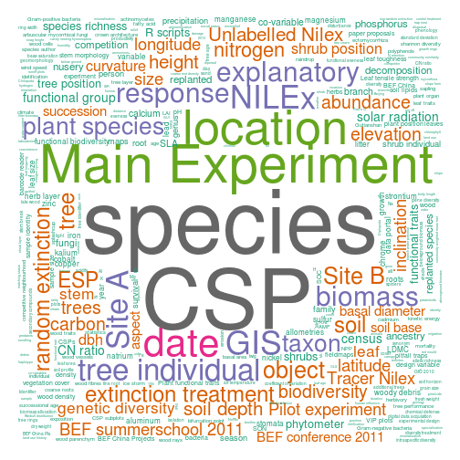

## Abstract 

The story board:

* Huge amount of data available (deluge of data)
* More and more gets accessible (with some hindrances) 
    - metadata missing (renders data useless) 
    - lack of reward for data providers (people keep their data secret)
    - so lots of data gets still lost (needs help e.g rebind)
* Data often hard to find/reuse 
    - if not well described 
* But there is a growing need to reuse data 
    - so we need tools supporting researchers in doing so (reuse available)
* The BEFdata portal provides a good base for heterogeneous data in ecology  
    - we dock onto that with rbefdata to pull data into data statistics  
    - Data life cycle (we cover it partially focused and doing this well) 
        + BEFdata (Store data, Describe it with metadat, Collaborate and Share it)
        + rbefdata (Find and understand and analyse data as well as reuse of data). 

## Introduction 

With a growing awareness in the last years on the long term value of data, many
effort has been put into building data management platforms to preserve data
(Data One, GBIF, BEFdata). So many specialized solutions for diffrent
scientific disciplines appeared like for example the diversity workbench or
BEFdata that offer solutions for smaller scale projects. Other platforms offer
solutions for a small projects or collaborations (cite e.g BEFdata) up to
global databases that serve as nodes that integrate smaller platforms and serve
as data warehouses (DATA ONE, GBIF, cite xxx). 

While some research disciplies do very well with the solutions available (e.g
Genetics), others facing more problems. For example, ecology has grown into a
more collaborative, interdisciplinary and data intensive science over the last
decade, to address questions on a greater temporal and spatial scale (e.g
michener et al 2012). The data here is mainly provided by small scale studies
spread all over the world (e.g heidorn2009 shedding light on the dark) but also
through bigger long term projects like LTER (cite xxx), BEF-China (cite xxx),
governmental projects and private initiatives (cite xxx). This in fact results
in a wild growing, complex and heterogeneous data landscape in ecology that we
need to deal with.  

While the process of understanding data is meanwhile more guided by metadata
the process of cleaing, reshaping and integrating the data still needs a lot of
manual intervention. It usually takes up to 70% of the analysis workflow (cite
me and Karin as well as the other workflow analysis paper) and is potentially
one step that is error prone especially as the complexity of analyses grows. 

The application of ontologies in ecology is discussed controversally which is
mainly related to the heterogeneity of the research domain and it is argued 
that they can be a benefit 

()


The integration of dataset into meta analyses is still a very time and labour
intensive process. 

which is
error prone especially with a growing heterogeneity of the onderlying data.

and cleaning 


Ontology needs also be discussed here a bit more intensive... 

Ontologies can play an important role as they potentially offer backbones for
the development of smart tools helping researchers to find and merge data (cite
XXX). But their application in ecology is discussed controversially as
capturing the knowledge of ecology in a formal representation can be highly
complex for a interdisciplinary research domains. 

We here show how heterogeneous data from the BEF-China project is integrated
into a workflow using the combination of the BEFdata portal and its companion
package `rbefdata`. We use data that is already published and open access so
everybody will be able to reproduce this analysis.

## Material and Methods 

### BEFdata portal

The BEFdata portal (cite Kain,
[url](http://befdataproduction.biow.uni-leipzig.de/)) is a data management
platform developed within the BEF-China project (FOR 891) of the German science
foundation. It is specialized in harmonizing small heterogeneous data, offers a
social component that lowers the hurdles on sharing data online and tools that
help researchers to describe their data with metadata.

### Data used

The data used for the presentation of this package stems from (A. Lang. ...)
from the BEFdata portal. The data is free as it already was published.

### Rbefdata

The `rbefdata` package offers an option list that is used to determine the
servers URLs the package contacts to to retrieve data, the download folder name
for attached free format content of a dataset and 

* load the package


```r
require(rbefdata)
```


* list options


```r
bef.options()
```

```
## $url
## [1] "http://china.befdata.biow.uni-leipzig.de"
## 
## $tematres_url
## [1] "http://tematres.befdata.biow.uni-leipzig.de/vocab/index.php"
## 
## $tematres_service_url
## [1] "http://tematres.befdata.biow.uni-leipzig.de/vocab/services.php"
## 
## $download_dir
## [1] "downloads"
## 
## $user_credentials
## [1] ""
```


* query options


```r
bef.options("url")
```

```
## [1] "http://china.befdata.biow.uni-leipzig.de"
```


* set options 


```r
bef.options(user_credentials = "aölkjspoiul12")
bef.options(url = "http://my.own.befdat.instance.com")
```


Introduction to the rbefdata R package

* get datasets 

In the very heart of the BEFdata portal there is a paper proposal process
integrated. You shop together datasets and afterwards create a paper proposal
based on the shopped dataset. In the proposal you have to give information like
a title for the proposal and a rationale describing how you intend to use the
data and where and when to publish the results. If the proposal is handed in
the authors will be informed that somebody likes to access their datasets and
they can decide if they like to participate and how. After all authors have
granted access on is good to go with the `rbefdata` package. One can draw all
datasets associated to a proposal in one turn with the package.


```r
dataset_list = bef.portal.get.datasets_for_proposal(id = 1)
```

```
## Error: Not Found
```

```r
extract_one_dataset = dataset_list[[1]]
```

```
## Error: object 'dataset_list' not found
```


* Inspect datasets

The BEFdata portal offers metadat in Ecological Metadata Language format
standard for download (cite EML). We make use of that metadata in the`rbefdata`
package as well and each dataset is associated with its metadata on download.
So you always have acces to the information that is required to understand a
dataset. This information can be extracted from a dataset with the R command
`attributes()`


```r
dataset_list = bef.portal.get.dataset_for_proposal(id = 1)
```

```
## Error: could not find function "bef.portal.get.dataset_for_proposal"
```

```r
attributes(dataset_list[[1]])$title
```

```
## Error: object 'dataset_list' not found
```

* write your scripts 


* vizualize the portal (keywords) 

see figure ... in appendix

## Results 

## Discussion

## Appendix

### Figures 


```r

bef.portal.vizualize.keywords()
```

```
## Warning: chemical leaf composition could not be fit on page. It will not
## be plotted. Warning: individual based values could not be fit on page. It
## will not be plotted. Warning: wood perforation plates could not be fit on
## page. It will not be plotted. Warning: cadmium at wavelength 214nm could
## not be fit on page. It will not be plotted. Warning: cadmium at wavelength
## 228nm could not be fit on page. It will not be plotted. Warning: cation
## exchange capacity could not be fit on page. It will not be plotted.
## Warning: data management could not be fit on page. It will not be plotted.
## Warning: leaf anatomy could not be fit on page. It will not be plotted.
## Warning: leaf physical resistance could not be fit on page. It will not be
## plotted. Warning: microbial biomass could not be fit on page. It will not
## be plotted. Warning: phylogenetic diversity could not be fit on page. It
## will not be plotted. Warning: plant trait could not be fit on page. It
## will not be plotted. Warning: rarefied diversity could not be fit on page.
## It will not be plotted. Warning: response variable could not be fit on
## page. It will not be plotted. Warning: soil erosion could not be fit on
## page. It will not be plotted. Warning: spatial genetic structure could not
## be fit on page. It will not be plotted. Warning: species trait could not
## be fit on page. It will not be plotted. Warning: trait dissimilarity could
## not be fit on page. It will not be plotted. Warning: wood bending could
## not be fit on page. It will not be plotted. Warning: wood compression
## could not be fit on page. It will not be plotted. Warning: wood shearing
## could not be fit on page. It will not be plotted. Warning: wood shrinkage
## could not be fit on page. It will not be plotted. Warning: wood stretching
## could not be fit on page. It will not be plotted. Warning: wood toughness
## could not be fit on page. It will not be plotted. Warning: aeromorphic
## organic layer could not be fit on page. It will not be plotted. Warning:
## basal area increment could not be fit on page. It will not be plotted.
## Warning: BEF China projects could not be fit on page. It will not be
## plotted. Warning: climatic niche could not be fit on page. It will not be
## plotted. Warning: crown overlap could not be fit on page. It will not be
## plotted. Warning: crown projection area could not be fit on page. It will
## not be plotted. Warning: directed extinction could not be fit on page. It
## will not be plotted. Warning: eco-physiologic traits could not be fit on
## page. It will not be plotted. Warning: ecosystem functioning could not be
## fit on page. It will not be plotted. Warning: experimental treatment could
## not be fit on page. It will not be plotted. Warning: flight interception
## could not be fit on page. It will not be plotted. Warning: Flora of China
## could not be fit on page. It will not be plotted. Warning: food web could
## not be fit on page. It will not be plotted. Warning: forest canopy could
## not be fit on page. It will not be plotted. Warning: genetic
## autocorrelation could not be fit on page. It will not be plotted. Warning:
## hunting type could not be fit on page. It will not be plotted. Warning:
## inbreeding could not be fit on page. It will not be plotted. Warning:
## litter thickness could not be fit on page. It will not be plotted.
## Warning: mixed models could not be fit on page. It will not be plotted.
## Warning: multi-trophic interactions could not be fit on page. It will not
## be plotted. Warning: phylogenetic distinctness could not be fit on page.
## It will not be plotted. Warning: phytophagous insects could not be fit on
## page. It will not be plotted. Warning: PI meeting could not be fit on
## page. It will not be plotted. Warning: rainfall simulator could not be fit
## on page. It will not be plotted. Warning: research proposals could not be
## fit on page. It will not be plotted. Warning: rooting depth could not be
## fit on page. It will not be plotted. Warning: simpson diversity could not
## be fit on page. It will not be plotted. Warning: species identity variable
## could not be fit on page. It will not be plotted. Warning: stem core could
## not be fit on page. It will not be plotted. Warning: temperature could not
## be fit on page. It will not be plotted. Warning: topography could not be
## fit on page. It will not be plotted. Warning: vegetation stratum could not
## be fit on page. It will not be plotted. Warning: wood ground tissue could
## not be fit on page. It will not be plotted. Warning: wood mechanics could
## not be fit on page. It will not be plotted. Warning: wood porosity could
## not be fit on page. It will not be plotted.
```

 

### Tables
